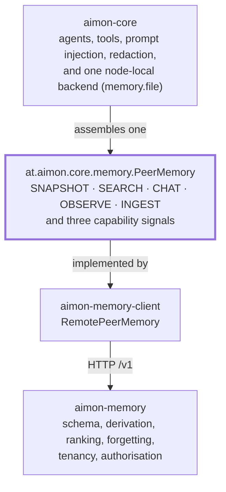

[한국어](0007-aimon-core-boundary.md) · **English**

# ADR 0007 — The boundary with aimon-core is `PeerMemory`, and nothing else

**Status:** accepted · 2026-09-04

## Context

This service was built as a standalone memory system, and aimon-core was built with a memory
subsystem of its own. Until recently both statements were true at once in a way that left the
boundary unstated: aimon-core carried three storage backends (`aimon-memory-file`,
`aimon-memory-postgres`, `aimon-memory-mongodb`) whose names look like modules of this repository,
and `aimon-memory-client` implemented `at.aimon.core.memory.PeerMemory` against this service without
anything recording which of the two systems owned what.

That has now been settled on aimon-core's side. `aimon-memory-postgres` and `aimon-memory-mongodb`
were removed, `aimon-memory-file` was merged into `aimon-core` as `at.aimon.core.memory.file`, and
distributed memory is this service. Nothing in *this* repository changed, which is exactly why the
boundary is worth writing down: it is now load-bearing in both directions and visible in neither
build.

## Decision

**`at.aimon.core.memory.PeerMemory` is the only seam. Everything above it is aimon-core's;
everything behind it is ours.**

aimon-core owns the agent — execution, tools, prompt injection, redaction — and one node-local
memory backend for deployments that do not want a service. This repository owns durable multi-tenant
memory: the schema, the derivation pipeline, ranking, and the tenancy model. The two meet at five
interfaces and one adapter, and at no other point.

### What `RemotePeerMemory` fills

`PeerMemory` hands back an `Optional` per tier, so a backend cannot claim a capability it does not
implement. This adapter returns all five present:

| aimon-core tier | endpoint | notes |
| --- | --- | --- |
| `MemorySnapshotReader` (SNAPSHOT) | `GET /v1/workspaces/{ws}/conclusions` | the deterministic context read |
| `MemorySearcher` (SEARCH) | `POST /v1/workspaces/{ws}/recall` | Tier 1 — six signals, fixed weights |
| `DialecticEngine` (CHAT) | `POST /v1/workspaces/{ws}/chat` | Tier 2 — the agentic path |
| `ObservationRecorder` (OBSERVE) | `POST /v1/workspaces/{ws}/conclusions` | direct conclusion injection |
| `MemoryIngestor` (INGEST) | `POST /v1/workspaces/{ws}/sessions/{session}/messages` | queues; the worker derives |

Three capability signals are `false`, and each is a difference rather than a gap —
`narrowsBySession()` because a conclusion outlives the session that produced it, `storesConfidence()`
because an injected observation's confidence is derived from its level and reinforcement rather than
supplied, and a receipt that never reports `derived` because ingestion queues. aimon-core's SPI has a
place to say each of those out loud, which is the property that makes the seam usable: a caller finds
out before the call rather than by comparing results.

### `WorkspaceStore` and `WorkspaceAccessPolicy` are not tiers, and that is ours to be

The five tiers are the whole seam. Workspace CRUD and tenancy are deliberately **not** among them:
aimon-core's design decided that a remote backend owns them and that the core passes a configured
workspace name in the path
(`pluggable-memory-backend.md` §4.3). `WorkspaceStore` and `WorkspaceAccessPolicy` remain in
aimon-core as materials of *its* default backend, and mean nothing to us.

We take that position up. On this side the workspace is `WorkspaceRepository` — `getOrCreate`,
`find`, `updateConfiguration`, `list` — and its policy is `WorkspaceSettingsService`, which resolves
per-workspace configuration and the analyzer that goes with it, rejects tuning keys at the wrong
level, and validates configuration at the write boundary. Authorisation is JWT scope plus
`RoutePolicy`, not an ACL object handed across the seam.

The consequence to hold on to: **aimon-core never creates a workspace here.** A workspace exists
because an operator or an admin token made it, with its analyzer and its settings; the adapter names
one that already exists. A design where the agent could conjure tenants would put tenancy on the
wrong side of a boundary drawn precisely to keep it here.

### What was removed from aimon-core, and what of ours took its place

Read this as a replacement table, not a migration table.

| Removed from aimon-core | What here does that job |
| --- | --- |
| `PostgresDerivationQueueManager` — row-locked derivation queue | `aimon-memory-worker`: `WorkerLoop` plus the Representation / Summary / Dream / Deletion consumers, over `QueueRepository`'s claims |
| `KnowledgeStoreOutboxRelay` — outbox → embedding index | pgvector natively: `Vectors`, `EmbeddingDimensionCheck`, `aimon-memory-embed`. There is no outbox because the vector is a column in the same transaction as the row |
| `Postgres`/`Mongo` `{Observation,Representation,Workspace}Store` | `aimon-memory-store`: Flyway plus twelve repositories |
| `aimon-memory-file` (a module) | nothing here — it moved *into* `aimon-core` as `at.aimon.core.memory.file`, and remains the node-local option for deployments that do not run this service |

**None of this is a migration.** Our schema is keyed on `(workspace, observer, observed)` from
day one (ADR 0002's composite foreign key), which the removed backends had no equivalent of, and no
tool moves `mem_*` rows into it. A deployment with data in the old Postgres or Mongo memory backend
either stays on aimon-core 0.2.4 or starts empty here. Anyone reading the similar module names as a
rename will look for an upgrade path that does not exist.

### Version coupling, and which side moves first

`aimon-memory-client` compiles against `at.aimon.core:aimon-core:0.2.4` — the first release
containing the five tiers — pinned as `aimonCore` in `gradle/libs.versions.toml`, and
`:aimon-memory-client:verifyCoreIsReleased` refuses a publish when that resolved to a project rather
than a released artifact or when the jar does not contain `PeerMemory`.

So the coupling is: **a released aimon-core, one direction, at compile time.** The ordering that
follows is not symmetric.

1. A change to `PeerMemory` or a tier interface lands in aimon-core, deprecating rather than
   replacing where it can (that repository's `api-stability.md` §5).
2. aimon-core releases.
3. We raise `aimonCore` and adapt.

Doing it the other way round leaves this repository uncompilable against every published aimon-core,
and there is no build in either repository that would notice until someone tries. aimon-core's
`api-stability.md` §4.2 records the same obligation from its side.

A composite build (`includeBuild`) makes step 3 comfortable and step 2 invisible, which is why the
check above exists rather than a convention.

### Contract verification: consuming `aimon-memory-testkit`

aimon-core publishes `at.aimon.core:aimon-memory-testkit` — `AbstractPeerMemoryContractTest`, the
five-tier contract suite. It was unpublished until this boundary settled, and publishing it is the
direct consequence of that: the suite's subjects are `PeerMemory` backends, and after the removals
above the backend most in need of the contract was `RemotePeerMemory`, in a repository that could not
depend on it.

We do not consume it yet. The path, when we do:

1. Add the coordinate to `gradle/libs.versions.toml` next to `aimon-core`, at the same `aimonCore`
   version — the two are one artifact set and must not drift.
2. `testImplementation` on `:aimon-memory-client`. Note the name collision: this build already has a
   Gradle project called `:aimon-memory-testkit` (our fixtures and stubs). The external coordinate
   and the internal project share a name and nothing else, so reference the external one by GAV
   through the catalog and never by `project(...)`.
3. Extend the class with a `newBackend()` that returns a `RemotePeerMemory` pointed at a server on an
   ephemeral port — the shape `RemotePeerMemoryWireTest` already uses, so the harness exists.
4. Expect the honest signals to be *asserted* rather than tolerated. Of the suite's four
   capability-negotiation contracts, the one this adapter is on the demanding side of is
   `narrowsBySession()=false` — a session id must not be silently ignored. `ranksByScore()` is
   **`true`** here, since recall returns a fused score, so this adapter takes the other branch of that
   contract and owes a real `minScore` filter rather than a documented refusal. The third `false`,
   `storesConfidence()`, belongs to OBSERVE rather than to SEARCH's two axes.

**Step 3 is not wiring alone, and the gap has been measured rather than guessed.** As written,
`RemoteSearcher.search` never reads `MemorySearchQuery.getSessionId()` — a query carrying a session id
comes back with results from every session, and nothing is thrown. The suite's
`sessionIdIsRejectedRatherThanIgnored` requires an `IllegalArgumentException` on exactly that
combination (`narrowsBySession() == false` plus a session id), which the store-backed default does
raise. So extending the class today produces a red test, and going green needs a change in the adapter,
not in the test: `RemoteSearcher` has to reject.

It also needs the tier's javadoc reversed, which is the part worth stating plainly. That javadoc
currently argues the opposite position — *"the session is not dropped quietly … this flag is how the
caller finds that out"* — and the contract is a considered rejection of it: a signal published
alongside a wider answer is still a filter that did not run, and the caller reads the result as the
narrower one they asked for. Adopting the suite means adopting that judgement over ours. It is one
method and one paragraph, but it is a decision, and it belongs to the change that wires the suite up
rather than to this document.

Until then, `RemotePeerMemoryWireTest` is what stands in: a real server, the pair's direction, the
five tiers' bodies and the three signals. It checks that we send and parse what we think we do. It
cannot check that our answers mean the same as another backend's, which is the whole reason the
shared suite exists.

## Consequences

- **The seam is one type.** Anything that makes aimon-core know a second thing about this service —
  a workspace type, a scoring field, an endpoint shape — is a boundary violation regardless of how
  convenient it is, because the tiers are what a *different* backend would also have to satisfy.
- **`PeerMemory` is now effectively frozen for us.** It was aimon-core's public API already; it is
  now also our compile surface, and a change there breaks a build its own CI cannot see.
- **Tenancy stays here.** Workspace creation, settings, analyzer choice and authorisation are ours,
  and aimon-core has no vocabulary for them by design.
- **The removed backends have no upgrade path, and saying so is part of the deliverable.** The names
  are close enough that silence would be read as a migration.
- **Contract parity is aspirational until step 3 above happens — and it is known to be unmet, not
  merely unmeasured.** `RemoteSearcher` ignores a session id where the contract requires rejection, so
  the suite would fail today. Two backends claiming the same contract with only one of them running
  the suite is the state that suite was written to end; a repository that knows which assertion would
  fail and does not say so is a worse version of that state.

---

## Addendum · 2026-09-05 — steps 1-4 were taken, and two sentences above are now false

The decision stands and is not rewritten. Two statements of *fact* in it are not true any more,
and leaving them would make this page assert the opposite of what the tree does.

| Above | Now |
|---|---|
| "We do not consume it yet." | `RemotePeerMemoryContractTest` extends `AbstractPeerMemoryContractTest`. |
| "Contract parity … is known to be unmet … the suite would fail today." | It failed, was fixed, and passes — 21 tests, **0 skipped**, all five tiers exercised. |

Steps 1-4 did not wait for aimon-core `0.3.0`. `publishToMavenLocal -PVERSION_NAME=0.3.0-SNAPSHOT`
plus `mavenLocal()` here resolves the coordinate, so the ordering this ADR assumed — release first,
wire second — held as a dependency but not as a schedule. What actually blocked the wiring was a
resolvable coordinate, and a release is only one way to get one.

**Two assertions failed on the first run, not one.** `sessionIdIsRejectedRatherThanIgnored` failed
as this ADR predicted. `recordingAssignsAnIdentity` also failed, and nothing here predicted it:
`Principal.equals` compares `displayName` while `PeerView.toString` prints only the id, so the
adapter was returning a subject that differed from the one it was handed and printed identically to
it. Reading the suite could not have found that; running it did. That is the argument for step 3
restated as a result rather than a plan.

**The wiring stands on scaffolding.** `mavenLocal()` in `settings.gradle.kts` and
`build.gradle.kts`, and `aimonCore = "0.3.0-SNAPSHOT"`, all come out when `0.3.0` reaches Central.
Forgetting is not silent: `verifyCoreIsReleased` now rejects a snapshot and names the three lines.

---

## Addendum · 2026-09-05 — the snapshot pin was split, and a fresh clone builds again

The scaffolding the addendum above describes did not survive contact with an open repository. Holding
`aimonCore` at `0.3.0-SNAPSHOT` let an artifact that exists in one `~/.m2` decide whether the whole
build compiles: `contractTest`'s superclass is unresolvable without it, an unresolvable superclass
fails `compileTestJava`, and that took `aimon-memory-client` — and with it `checkAll` — down on every
fresh clone and every CI runner.

| Then | Now |
|---|---|
| `aimonCore = "0.3.0-SNAPSHOT"` | `aimonCore = "0.2.4"`, released and on Central |
| the suite in `src/test` | a `contractTest` source set that skips itself, by name and with a reason, when the coordinate does not resolve |
| one version for both coordinates | `aimonTestkit = "0.3.0-SNAPSHOT"`, held separately and reached by that source set alone |

`mavenLocal()` stays in `settings.gradle.kts` and `build.gradle.kts` for that one coordinate. Both
lines and the second version still come out when 0.3.0 reaches Central. What changed is that until
then, nothing on the path from `git clone` to `checkAll` reaches through them.
