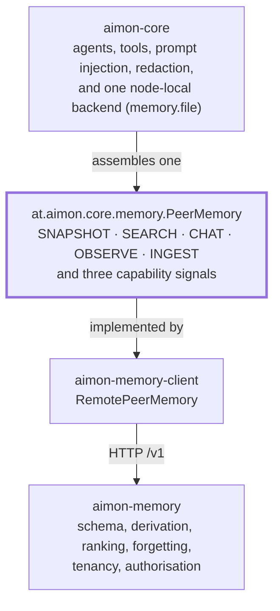

**한국어** · [English](0007-aimon-core-boundary.en.md)

# ADR 0007 — aimon-core 와의 경계는 `PeerMemory` 이고, 그것뿐이다

**상태:** accepted · 2026-09-04

## 맥락

이 서비스는 독립된 메모리 시스템으로 만들었고, aimon-core 는 자기 메모리 서브시스템을 갖고 만들었다.
얼마 전까지 두 문장이 동시에 참이었고, 그 바람에 경계가 말해지지 않은 채 남아 있었다. aimon-core 는 이
저장소의 모듈처럼 보이는 이름을 단 스토리지 백엔드 셋(`aimon-memory-file`, `aimon-memory-postgres`,
`aimon-memory-mongodb`)을 들고 있었고, `aimon-memory-client` 는 이 서비스 위에
`at.aimon.core.memory.PeerMemory` 를 구현하고 있었지만, 두 시스템 중 어느 쪽이 무엇을 소유하는지 적어
둔 것은 아무것도 없었다.

그쪽은 이제 정리됐다. `aimon-memory-postgres` 와 `aimon-memory-mongodb` 는 제거됐고,
`aimon-memory-file` 은 `at.aimon.core.memory.file` 로 `aimon-core` 안에 흡수됐으며, 분산 메모리는 이
서비스다. *이* 저장소에서는 아무것도 바뀌지 않았는데, 바로 그래서 경계를 적어 둘 값어치가 있다. 이제
양방향으로 하중을 받으면서 어느 쪽 빌드에도 보이지 않기 때문이다.

## 결정

**`at.aimon.core.memory.PeerMemory` 가 유일한 이음매다. 그 위는 aimon-core 의 것이고, 그 뒤는 우리
것이다.**

aimon-core 는 에이전트를 소유한다 — 실행, 도구, 프롬프트 주입, 마스킹, 그리고 서비스를 띄우고 싶지 않은
배포를 위한 노드 로컬 메모리 백엔드 하나. 이 저장소는 지속되는 멀티테넌트 메모리를 소유한다 — 스키마,
도출 파이프라인, 순위, 테넌시 모델. 둘은 인터페이스 다섯 개와 어댑터 하나에서 만나고, 다른 어디에서도
만나지 않는다.

### `RemotePeerMemory` 가 채우는 것

`PeerMemory` 는 티어마다 `Optional` 을 돌려주므로, 백엔드가 구현하지 않은 능력을 주장할 수 없다. 이
어댑터는 다섯 개를 모두 채워 돌려준다.

| aimon-core 티어 | 엔드포인트 | 비고 |
| --- | --- | --- |
| `MemorySnapshotReader` (SNAPSHOT) | `GET /v1/workspaces/{ws}/conclusions` | 결정적 컨텍스트 읽기 |
| `MemorySearcher` (SEARCH) | `POST /v1/workspaces/{ws}/recall` | Tier 1 — 여섯 신호, 고정 가중치 |
| `DialecticEngine` (CHAT) | `POST /v1/workspaces/{ws}/chat` | Tier 2 — 에이전틱 경로 |
| `ObservationRecorder` (OBSERVE) | `POST /v1/workspaces/{ws}/conclusions` | 결론 직접 주입 |
| `MemoryIngestor` (INGEST) | `POST /v1/workspaces/{ws}/sessions/{session}/messages` | 큐에 넣고, 워커가 도출한다 |

능력 신호 세 개는 `false` 이고, 셋 다 구멍이 아니라 차이다 — 결론은 그것을 만든 세션보다 오래 살기
때문에 `narrowsBySession()`, 주입된 관측의 confidence 는 받아 적는 것이 아니라 등급과 강화 횟수에서
나오기 때문에 `storesConfidence()`, 그리고 수집이 큐에 넣기 때문에 접수증에 `derived` 가 실리는 일이
없다. aimon-core 의 SPI 에는 이 셋을 소리 내어 말할 자리가 있고, 그 성질이 이 이음매를 쓸 만하게 만든다.
호출하는 쪽이 결과를 비교해 보고 나서가 아니라 호출하기 전에 알게 된다.

### `WorkspaceStore` 와 `WorkspaceAccessPolicy` 는 티어가 아니고, 그건 우리 몫이다

티어 다섯이 이음매의 전부다. workspace CRUD 와 테넌시는 **일부러** 거기 없다. 원격 백엔드가 그것을
소유하고 코어는 설정된 workspace 이름을 경로에 실어 넘긴다고 aimon-core 의 설계가 결정했다
(`pluggable-memory-backend.md` §4.3). `WorkspaceStore` 와 `WorkspaceAccessPolicy` 는 *그쪽* 기본
백엔드의 재료로 aimon-core 에 남아 있고, 우리에게는 아무 의미도 없다.

우리는 그 자리를 받아 든다. 이쪽에서 workspace 는 `WorkspaceRepository` 다 — `getOrCreate`, `find`,
`updateConfiguration`, `list`. 그 정책은 `WorkspaceSettingsService` 이고, workspace 별 설정과 거기 딸린
분석기를 결정하고, 잘못된 층위의 튜닝 키를 거부하고, 쓰기 경계에서 설정을 검증한다. 인가는 이음매 너머로
건네지는 ACL 객체가 아니라 JWT scope 와 `RoutePolicy` 다.

붙잡아 둘 결론 하나. **aimon-core 는 여기에 workspace 를 만들지 않는다.** workspace 는 운영자나 admin
토큰이 분석기와 설정을 정해 만들었기 때문에 존재하고, 어댑터는 이미 있는 것의 이름을 부를 뿐이다.
에이전트가 테넌트를 불러낼 수 있는 설계라면, 테넌시를 이쪽에 두려고 그은 경계의 반대편에 테넌시를 놓게
된다.

### aimon-core 에서 무엇이 빠졌고, 우리 쪽 무엇이 그 자리를 대신하는가

마이그레이션 표가 아니라 대체 표로 읽어야 한다.

| aimon-core 에서 제거된 것 | 여기서 그 일을 하는 것 |
| --- | --- |
| `PostgresDerivationQueueManager` — 행 잠금 기반 도출 큐 | `aimon-memory-worker`: `WorkerLoop` 와 Representation / Summary / Dream / Deletion 컨슈머들이 `QueueRepository` 의 클레임 위에서 |
| `KnowledgeStoreOutboxRelay` — outbox → 임베딩 인덱스 | pgvector 자체: `Vectors`, `EmbeddingDimensionCheck`, `aimon-memory-embed`. 벡터가 행과 같은 트랜잭션 안의 컬럼이라 outbox 가 없다 |
| `Postgres`/`Mongo` `{Observation,Representation,Workspace}Store` | `aimon-memory-store`: Flyway 와 리포지토리 열두 개 |
| `aimon-memory-file` (모듈 하나) | 여기에는 없다 — `at.aimon.core.memory.file` 로 `aimon-core` *안으로* 옮겨 갔고, 이 서비스를 띄우지 않는 배포를 위한 노드 로컬 선택지로 남아 있다 |

**이 중 어느 것도 마이그레이션이 아니다.** 우리 스키마는 1일차부터 `(workspace, observer, observed)` 로
키잉돼 있고(ADR 0002 의 복합 외래키), 제거된 백엔드에는 그에 대응하는 것이 없었으며, `mem_*` 행을 이쪽으로
옮겨 주는 도구도 없다. 예전 Postgres 나 Mongo 메모리 백엔드에 데이터가 있는 배포는 aimon-core 0.2.4 에
머물거나, 여기서 빈 상태로 시작하는 수밖에 없다. 비슷한 모듈 이름을 이름 변경으로 읽는 사람은 존재하지
않는 업그레이드 경로를 찾게 된다.

### 버전 결합, 그리고 어느 쪽이 먼저 움직이는가

`aimon-memory-client` 는 `at.aimon.core:aimon-core:0.2.4` — 다섯 티어를 담은 첫 릴리스 — 를 상대로
컴파일하고, 그 버전은 `gradle/libs.versions.toml` 에 `aimonCore` 로 고정돼 있으며,
`:aimon-memory-client:verifyCoreIsReleased` 는 그것이 릴리스된 아티팩트가 아니라 프로젝트로 풀렸을 때,
또는 jar 안에 `PeerMemory` 가 없을 때 publish 를 거부한다.

그러니 결합은 이렇다. **릴리스된 aimon-core, 한 방향, 컴파일 시점.** 거기서 따라 나오는 순서는 대칭이
아니다.

1. `PeerMemory` 나 티어 인터페이스의 변경은 aimon-core 에 먼저 들어간다. 가능한 자리에서는 교체가 아니라
   deprecate 로(그 저장소의 `api-stability.md` §5).
2. aimon-core 가 릴리스한다.
3. 우리가 `aimonCore` 를 올리고 맞춘다.

거꾸로 하면 이 저장소는 발행된 어떤 aimon-core 로도 컴파일되지 않는 상태가 되고, 누가 시도하기 전까지
그것을 알아챌 빌드는 양쪽 어디에도 없다. aimon-core 의 `api-stability.md` §4.2 가 같은 의무를 그쪽에서
기록하고 있다.

컴포짓 빌드(`includeBuild`)는 3단계를 편하게 만들고 2단계를 보이지 않게 만든다. 관례가 아니라 위의
검사가 있는 이유다.

### 계약 검증: `aimon-memory-testkit` 을 소비하기

aimon-core 는 `at.aimon.core:aimon-memory-testkit` 을 발행한다 — `AbstractPeerMemoryContractTest`,
다섯 티어 계약 스위트다. 이 경계가 정리되기 전까지는 발행되지 않았고, 발행은 그 정리의 직접적인 결과다.
이 스위트의 대상은 `PeerMemory` 백엔드이고, 위의 제거 이후 계약이 가장 필요한 백엔드는
`RemotePeerMemory` 였는데, 그것이 있는 저장소가 스위트에 의존할 수 없었다.

아직 쓰지 않는다. 쓰게 될 때의 경로는 이렇다.

1. 좌표를 `gradle/libs.versions.toml` 의 `aimon-core` 옆에, 같은 `aimonCore` 버전으로 추가한다 — 둘은
   하나의 아티팩트 집합이고 어긋나면 안 된다.
2. `:aimon-memory-client` 에 `testImplementation` 으로 건다. 이름 충돌에 주의할 것. 이 빌드에는
   `:aimon-memory-testkit` 이라는 Gradle 프로젝트가 이미 있다(우리 픽스처와 스텁). 외부 좌표와 내부
   프로젝트는 이름만 같고 그 밖에는 아무 관계도 없으니, 외부 쪽은 카탈로그를 통해 GAV 로만 참조하고
   절대 `project(...)` 로 부르지 않는다.
3. 임시 포트에 띄운 서버를 가리키는 `RemotePeerMemory` 를 돌려주는 `newBackend()` 로 그 클래스를
   상속한다 — `RemotePeerMemoryWireTest` 가 이미 쓰는 모양이라 하네스는 있다.
4. 정직한 신호들이 용인되는 게 아니라 *검사받을* 것을 각오한다. 스위트의 능력 협상 계약 네 개 중 이
   어댑터가 요구받는 쪽에 서는 것은 `narrowsBySession()=false` 다 — 세션 id 를 조용히 무시해서는 안
   된다. 여기서 `ranksByScore()` 는 **`true`** 인데 recall 이 융합 점수를 돌려주기 때문이고, 그래서 이
   어댑터는 그 계약의 다른 가지를 타며 문서화된 거부가 아니라 진짜 `minScore` 필터를 빚진다. 세 번째
   `false` 인 `storesConfidence()` 는 SEARCH 의 두 축이 아니라 OBSERVE 에 속한다.

**3단계는 배선만이 아니고, 그 간격은 짐작이 아니라 측정된 것이다.** 지금 쓰인 대로라면
`RemoteSearcher.search` 는 `MemorySearchQuery.getSessionId()` 를 아예 읽지 않는다 — 세션 id 를 실은
질의가 모든 세션의 결과를 받아 오고, 아무것도 던져지지 않는다. 스위트의
`sessionIdIsRejectedRatherThanIgnored` 는 바로 그 조합(`narrowsBySession() == false` 에 세션 id)에서
`IllegalArgumentException` 을 요구하고, 스토어 기반 기본 구현은 실제로 던진다. 그러니 오늘 그 클래스를
상속하면 빨간 테스트가 나오고, 초록으로 만들려면 테스트가 아니라 어댑터를 고쳐야 한다. `RemoteSearcher`
가 거부해야 한다.

그리고 그 티어의 javadoc 을 뒤집어야 하는데, 이 대목은 분명히 말해 둘 값어치가 있다. 그 javadoc 은 지금
정반대 입장을 주장한다 — *"the session is not dropped quietly … this flag is how the caller finds that
out"*. 계약은 그 입장을 숙고해서 기각한 것이다. 더 넓은 답과 함께 실려 오는 신호도 결국 돌지 않은
필터이고, 호출한 쪽은 그 결과를 자기가 요청한 좁은 것으로 읽는다. 스위트를 받아들인다는 것은 우리 판단
대신 그 판단을 받아들인다는 뜻이다. 메서드 하나와 문단 하나지만 그것은 결정이고, 이 문서가 아니라
스위트를 배선하는 변경에 속한다.

그때까지는 `RemotePeerMemoryWireTest` 가 대신 선다. 실제 서버, 쌍의 방향, 다섯 티어의 본문, 신호 셋.
우리가 보낸다고 믿는 것을 보내고 파싱한다고 믿는 대로 파싱하는지는 확인한다. 우리 답이 다른 백엔드의
답과 같은 것을 뜻하는지는 확인하지 못하는데, 공유 스위트가 존재하는 이유가 통째로 그것이다.

## 결과

- **이음매는 타입 하나다.** aimon-core 가 이 서비스에 대해 두 번째 것을 알게 만드는 것은 — workspace
  타입이든, 점수 필드든, 엔드포인트 모양이든 — 아무리 편하더라도 경계 위반이다. 티어는 *다른* 백엔드도
  만족시켜야 하는 것이기 때문이다.
- **`PeerMemory` 는 우리에게 사실상 동결됐다.** 이미 aimon-core 의 공개 API 였고, 이제 우리의 컴파일
  표면이기도 하다. 거기서 뭔가 바뀌면 그쪽 CI 가 볼 수 없는 빌드가 깨진다.
- **테넌시는 여기 남는다.** workspace 생성, 설정, 분석기 선택, 인가는 우리 것이고, aimon-core 는 설계상
  그것을 말할 어휘를 갖고 있지 않다.
- **제거된 백엔드에는 업그레이드 경로가 없고, 그렇게 말하는 것까지가 산출물이다.** 이름이 충분히 가까워서
  침묵은 마이그레이션으로 읽힌다.
- **계약 동등성은 위 3단계가 일어나기 전까지 희망사항이고 — 측정되지 않은 것이 아니라 충족되지 않은 것으로
  알려져 있다.** `RemoteSearcher` 는 계약이 거부를 요구하는 자리에서 세션 id 를 무시하므로, 스위트는 오늘
  실패한다. 같은 계약을 주장하는 백엔드 둘 중 하나만 스위트를 돌리는 상태를 끝내려고 그 스위트가 쓰였다.
  어느 단언이 실패할지 알면서 말하지 않는 저장소는 그 상태의 더 나쁜 판이다.

---

## 덧붙임 · 2026-09-05 — 1~4단계를 밟았고, 위의 두 문장은 이제 거짓이다

결정은 그대로이고 다시 쓰지 않는다. 다만 그 안의 *사실* 진술 두 개가 더는 참이 아니며, 그대로 두면 이
문서가 트리와 정반대되는 주장을 하게 된다.

| 위에서 | 지금 |
|---|---|
| "아직 쓰지 않는다." | `RemotePeerMemoryContractTest` 가 `AbstractPeerMemoryContractTest` 를 상속한다. |
| "계약 동등성 … 충족되지 않은 것으로 알려져 있다 … 스위트는 오늘 실패한다." | 실패했고, 고쳤고, 통과한다 — 21개 테스트, **skip 0건**, 다섯 티어 전부 실행. |

1~4단계는 aimon-core `0.3.0` 을 기다리지 않았다. `publishToMavenLocal -PVERSION_NAME=0.3.0-SNAPSHOT`
에 여기 `mavenLocal()` 을 더하면 좌표가 풀리므로, 이 ADR 이 가정한 순서 — 릴리스가 먼저, 배선이 나중 —
는 의존 관계로는 성립했지만 일정으로는 성립하지 않았다. 배선을 실제로 막고 있던 것은 풀 수 있는
좌표였고, 릴리스는 그것을 얻는 여러 방법 중 하나일 뿐이다.

**첫 실행에서 실패한 단언은 하나가 아니라 둘이었다.** `sessionIdIsRejectedRatherThanIgnored` 는 이 ADR
이 예측한 대로 실패했다. `recordingAssignsAnIdentity` 도 실패했는데, 이것은 여기 아무도 예측하지 않았다.
`Principal.equals` 는 `displayName` 을 비교하는데 `PeerView.toString` 은 id 만 찍어서, 어댑터가 건네받은
것과 다른 subject 를 돌려주면서 출력은 똑같이 하고 있었다. 스위트를 읽어서는 찾을 수 없었고, 돌려서
찾았다. 3단계를 계획이 아니라 결과로 다시 말한 것이 이것이다.

**배선은 받침대 위에 서 있다.** `settings.gradle.kts` 와 `build.gradle.kts` 의 `mavenLocal()`, 그리고
`aimonCore = "0.3.0-SNAPSHOT"` 은 `0.3.0` 이 Central 에 닿으면 전부 빠진다. 잊어도 조용히 넘어가지
않는다. `verifyCoreIsReleased` 가 이제 스냅샷을 거부하면서 그 세 줄을 이름으로 짚는다.

---

## 덧붙임 · 2026-09-05 — 스냅샷 핀을 갈랐고, 새 클론이 다시 빌드된다

위 덧붙임이 말한 받침대는 공개 저장소와 마주치자 버티지 못했다. `aimonCore` 를 `0.3.0-SNAPSHOT` 에
두면 `~/.m2` 하나에만 있는 아티팩트가 빌드 전체의 컴파일 여부를 정하게 된다. 그것 없이는
`contractTest` 의 상위 클래스가 풀리지 않고, 풀리지 않는 상위 클래스는 `compileTestJava` 를 실패시키며,
그 바람에 `aimon-memory-client` 가, 따라서 `checkAll` 이, 모든 새 클론과 모든 CI 러너에서 쓰러졌다.

| 그때 | 지금 |
|---|---|
| `aimonCore = "0.3.0-SNAPSHOT"` | `aimonCore = "0.2.4"`, 릴리스됐고 Central 에 있다 |
| 스위트가 `src/test` 안에 | 좌표가 풀리지 않으면 이름과 이유를 대며 스스로 건너뛰는 `contractTest` 소스셋 |
| 두 좌표가 버전 하나를 공유 | `aimonTestkit = "0.3.0-SNAPSHOT"` 을 따로 두고, 그 소스셋만 손을 뻗는다 |

`mavenLocal()` 은 그 좌표 하나 때문에 `settings.gradle.kts` 와 `build.gradle.kts` 에 남는다. 0.3.0 이
Central 에 닿으면 두 줄과 두 번째 버전은 여전히 빠진다. 달라진 것은 그때까지 `git clone` 에서
`checkAll` 로 가는 길이 그것들을 거치지 않는다는 점이다.
