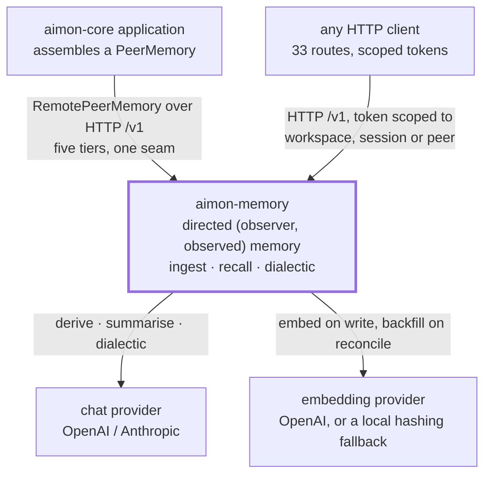

[한국어](architecture.md) · **English**

# Architecture

This document is the **canonical architecture description** for aimon-memory. Its section structure
follows [arc42](https://arc42.org) — having a named slot for where a new fact goes is the reason for
using the format.

**This document is kept thin.** Each section states the decision and its reasoning, then hands the
detail to whichever document already owns it. Where the same fact is described twice, one of them is
a summary and the summary carries a link to the canonical source.

| Document | What it owns |
|---|---|
| **this document** | Architecture description — goals, constraints, context, building blocks, quality, risks |
| [`concepts.en.md`](concepts.en.md) | Domain concepts and mechanisms. Pairs, the six signals, dedup, forgetting |
| [`guide.en.md`](guide.en.md) | How to call it. Tokens, routes, configuration keys, errors |
| [`runbook.en.md`](runbook.en.md) | Deployment and operations |
| [`adr/`](adr/README.en.md) | Decision records |
| [`openapi.json`](openapi.json) | The API description. Build-enforced |
| [`spec/`](spec/README.en.md) | The frozen specification (2026-08-31) |

> **Relationship to the specification.** `spec/aimon-memory-design.md` is normative and frozen. This
> document is **descriptive** — it records what the implementation is, not what it ought to be. Why
> the two are split that way is in [ADR 0008](adr/0008-arc42-architecture-doc.en.md).

---

## 1. Introduction and Goals

A memory system for conversational agents, running as two processes behind an HTTP API.

### The three core requirements

| | Requirement | Why it had to be settled on day one |
|---|---|---|
| R1 | Every fact belongs to a directed **`(observer, observed)` pair** | Adding it later is a rewrite, not a migration. The composite foreign key is on every conclusion |
| R2 | Lookups are answered **without a model, deterministically** | Most questions asked of a memory system are lookups. Not paying agent prices for them is why this system exists |
| R3 | Writes **never block HTTP on a model call** | Otherwise the memory system becomes a latency problem for everything that writes to it |

### The three top quality goals

Their measurable form and the gates that hold them are in [§10](#10-quality-requirements).

| | Quality | In one line |
|---|---|---|
| Q1 | **Determinism** | Tier 1 ranking is a pure function of its inputs. Same query, same answer |
| Q2 | **Explicability** | Every ranking carries the six signals that produced it; every belief traces back to a source sentence |
| Q3 | **Isolation** | One pair's memory does not leak into another's — not even via a request body |

### Stakeholders

| Who | What they need from this document |
|---|---|
| A developer using aimon-core | Where the boundary is and what gets swapped → [§3](#3-context-and-scope), [ADR 0007](adr/0007-aimon-core-boundary.en.md) |
| Someone contributing here | How the modules divide and what is enforced → [§5](#5-building-block-view) |
| Someone operating it | What to deploy and what not to publish → [§7](#7-deployment-view) |
| Someone tuning the ranking | What is a gate and what is still unproven → [§10](#10-quality-requirements), [§11](#11-risks-and-technical-debt) |

---

## 2. Constraints

### Technical constraints

| Constraint | Reasoning |
|---|---|
| **JDK 21**, pinned in `gradle/libs.versions.toml` | Rather than the plan's Java 25. [ADR 0001](adr/0001-stack.en.md) |
| **Spring MVC on virtual threads**, not WebFlux | Every handler is blocking JDBC. This gives the concurrency a reactive stack would while leaving the code and its stack traces readable |
| **One Postgres 16 + pgvector.** No three stores, no Redis | The queue is a table too. One piece of infrastructure to stand up. [ADR 0001](adr/0001-stack.en.md) |
| **No jOOQ code generation.** Hand-written SQL with Spring JDBC | Code generation demands a live database on every build, and there is exactly one dynamic query (`FilterCompiler`). [ADR 0002](adr/0002-persistence.en.md) |
| **No provider SDKs.** Direct HTTP | Controlling the tool loop needs an abstraction anyway, and no SDK offers the record/replay seam. [ADR 0003](adr/0003-llm-transport.en.md) |
| **Two processes, one codebase** | They scale differently and fail differently. [§7](#7-deployment-view) |

### Organisational and legal constraints

| Constraint | Reasoning |
|---|---|
| **Clean room.** The specification is `aimon-memory-design.md` alone, and everything expressive — prompts, schemas, SQL — was written from scratch | One of the two referenced systems is AGPL-3.0. [ADR 0005](adr/0005-agpl-boundary.en.md) |
| **Apache-2.0** | Matching aimon-core, which consumes this |
| **One coordinate to aimon-core** (`at.aimon.core:aimon-core`) | A fresh clone builds with no sibling checkout and no composite build. [ADR 0007](adr/0007-aimon-core-boundary.en.md) |

### Conventions

- **Korean is canonical.** Every document has an `.en.md` counterpart, the two frozen specifications
  excepted ([`spec/README.en.md`](spec/README.en.md) says why).
- **Documentation is build-enforced where it can be.** A test compares generated `openapi.json`
  against the committed one.
- **Diagrams are mermaid**, so the toolchain does not grow. Labels are in English, so both language
  editions share one block.

---

## 3. Context and Scope



### Business context

| Counterpart | What we receive | What we return |
|---|---|---|
| **aimon-core application** | Messages, injected conclusions, queries — through `PeerMemory`'s five tiers | Ranked conclusions, context, dialectic answers |
| **Any HTTP client** | 33 routes, scoped tokens | The same. Usable standalone, without aimon-core |
| **Chat provider** | — | Extraction, summarisation and dialectic prompts |
| **Embedding provider** | — | Conclusion, entity and query text |

### Technical context

| Interface | Protocol | Note |
|---|---|---|
| Service API | HTTP, 8080 | The auth interceptor covers `/v1/**` only |
| Management | HTTP, 9090 (API) · 9091 (worker) | **Not published.** No authentication |
| Database | JDBC, Postgres 16 + pgvector | Flyway runs at startup on both processes |
| Providers | HTTPS, called directly | No SDK. A record/replay seam sits in front |

### Out of scope

Agent execution, tools, prompt injection and redaction belong to **aimon-core**. This repository owns
durable multi-tenant memory — the schema, the derivation pipeline, ranking and tenancy. The boundary
is the single type `at.aimon.core.memory.PeerMemory`, and nothing else
([ADR 0007](adr/0007-aimon-core-boundary.en.md)).

---

## 4. Solution Strategy

Five choices determine most of the rest.

| Choice | What it buys | What it costs |
|---|---|---|
| **Pair-keying on day one** | Vantage points never merge. Bob's inference does not land in Alice's memory | Every route must name observer and observed. There is no default |
| **Tier 1 at the centre** | Lookups finish deterministically in ~100 ms. Tier 2 uses it as a tool and iterates less | Ranking quality carries most of the project's risk → [§10](#10-quality-requirements) |
| **Two processes** | HTTP is never bound to a model call. The two scale independently | Derivation is asynchronous. Read-your-writes becomes an opt-in `?wait=derive` |
| **One Postgres** | One thing to stand up. Queue, claims and vectors share a transactional boundary | Vector search is not as fast as a dedicated store. At this scale that is not the problem |
| **Fixed-weight fusion** | Scores are comparable across deployments. Fixtures pin them to six decimals | The weights must be exposed as configuration, and tuning them requires an evaluation set |

The detail is in [§8](#8-crosscutting-concepts) and [`concepts.en.md`](concepts.en.md).

---

## 5. Building Block View

### Level 1 — deployment units

| Block | Responsibility | Why it is separate |
|---|---|---|
| **API** | Accepting ingestion, Tiers 0–2, token minting, tenancy CRUD | Bound by latency. Restart it freely |
| **Worker** | Derivation, summarisation, dreams, reconciliation | Bound by provider latency. Holds queue claims across a restart |
| **Postgres** | Conclusions, entities, messages, events — and the queue | No broker. A claim is an insert, not a lock |

### Level 2 — modules

Dependencies only ever point downwards, and `ModuleDependencyTest` (ArchUnit) enforces it. One
upward import breaks the build.

```
aimon-memory-core      nothing. Domain types, six SPIs, key encoding.
aimon-memory-testkit   core, text. Golden fixtures, stubs, the Testcontainers base.

aimon-memory-text      core. Nori / Standard / bigram analyzers, normalisation, BM25, jtokkit.
aimon-memory-embed     core, text. Batching, truncation, retry, order preservation, the Embedder bean.
aimon-memory-llm       core. Provider backends, structured output, tool loop, record/replay.
aimon-memory-store     core, text. Flyway, repositories, pgvector, the filter compiler.

aimon-memory-recall    core, store, text, embed. Six signals, fusion, explain, provenance.
aimon-memory-engine    core, store, recall, llm, embed, text. Deriver, summariser, context,
                       dialectic, dreamer.

aimon-memory-worker    core, engine, store.          [runnable]  (+ text, recall in tests)
aimon-memory-api       core, recall, engine, store.  [runnable]

aimon-memory-client    aimon-core, jackson.          [the adapter, Java 17]
aimon-memory-bom       nothing. A java-platform pinning the published modules.
```

**This table is what `build.gradle.kts` declares, which is not what ArchUnit enforces.** The two
lists do not say the same thing: `mayOnlyDependOn` in `ModuleDependencyTest` is a **ceiling** — an
allowlist — and each module's `build.gradle.kts` is the **actual declaration**. The ceiling is wider
in places. The rule permits `llm` and `embed` to `worker` and `api`, and neither declares them;
`recall` was permitted `embed` long before it used it, and only declared it when
`RecallConfiguration` arrived. Do not read the ceiling as a dependency — that is how this document
was wrong for so long.

Assembly direction falls under the same caution. ArchUnit reads imports, so it **cannot see the
direction of the Spring wiring**. While `recall` scanned none of its own beans and took its
`Embedder` from `engine`, the compile graph was clean and the rule passed. A test holds that line
instead: `RecallConfigurationTest` assembles Tier 1 **without the engine module**, and it lives in
that module's own test source set, so it cannot pass by finding a bean in engine.

What the layering does is let three tracks build against each other's stubs instead of each other's
code. It degrades the moment one convenient upward import is added, at which point the next one is
easy to justify.

**All six SPIs are now consumed.** `Analyzer`, `Embedder` and `LlmClient` always were.
`ConclusionStore`, `EntityStore` and `EventLog` were implemented and called by nobody — every module
above the store injected the concrete `ConclusionRepository` and its siblings instead. For as long as
that held, the claim those three underwrote — that the storage layer is replaceable — was false, and
the interfaces being small (five methods) is what made it look plausible.

The rule now is one line: **a method is on an SPI exactly when it is called from outside
`aimon-memory-store`.** That puts 16 methods on `ConclusionStore` and 11 on `EntityStore`. What only
that module's own tests call (`archiveCandidates`, `entityIdsFor`) and what nothing calls at all
(`premisesOf`, `findById`) stayed on the concrete class: there is no reason to oblige the next
backend to implement the methods this one's tests happen to use.

**How far it reaches is written down too.** Conclusions, entities and the audit log can be backed by
another implementation. The other nine repositories — `queue`, `message`, `session`, `peer`,
`workspace`, `session_peer`, `dream`, `peer_card`, `collection` — are still injected by concrete
type. `SpiSurfaceTest` names those nine and fails if a sealed one is reached concretely again.
Whether to seal them is a decision rather than an omission: `QueueRepository`'s claim is an insert
against a partial unique index ([concepts §12](concepts.en.md#12-the-queue-and-work-units)), and an
interface over that would be a second description of one implementation — the state this section has
just left.


`aimon-memory-engine` is the tiers themselves — deriver, dialectic, dreamer, fan-out, ingestion. Both
the module and the package are named `engine` rather than `memory` so that neither repeats the
product name.

### Level 3

The black boxes are not opened further. Their interiors are owned by the code and by
[`concepts.en.md`](concepts.en.md).

---

## 6. Runtime View

Four scenarios cover most of what the system does. Each is described in full in `concepts.en.md`.

| Scenario | In one line | Detail |
|---|---|---|
| **Ingestion → conclusions** | Store, enqueue, return immediately. When a batch gate opens, the worker extracts once per observing pair, passes three-stage dedup, and writes | [concepts §6](concepts.en.md#6-the-write-path) · [§7](concepts.en.md#7-three-stage-dedup) |
| **Tier 1 recall** | Compute all six signals for every candidate, fuse under fixed weights, return with the breakdown. Zero model calls | [concepts §9](concepts.en.md#9-six-signals-and-the-fusion-formula) |
| **Tier 2 dialectic** | A tool loop with Tier 1 as one of its tools. `reasoningLevel` sets both the iteration cap and the toolset | [concepts §8](concepts.en.md#8-the-read-path--three-tiers) |
| **Dream** | Deduction, induction and contradiction over what is known, while nobody watches. All of it through the audit log | [concepts §13](concepts.en.md#13-the-dreamer-and-the-peer-card) |

### Two things to know about this view

**Extraction runs once per observing pair, not once per batch.** The prompt is written from the
observer's side, so two pairs are two different questions. The cost is N + N(N−1) per batch, and
`observe_others` is the lever ([ADR 0006](adr/0006-fanout-cost.en.md)).

**A claim is an insert, not a lock.** A unique violation on `work_unit_claims` is how a worker learns
someone else holds the key, so no transaction stays open across a model call.

---

## 7. Deployment View

**[`runbook.en.md`](runbook.en.md) is canonical.** The topology diagram, migration procedure, tuning,
load profile and backups live there. Only what is architecturally significant is recorded here.

| | API | Worker |
|---|---|---|
| Scale on | request rate | queue depth |
| Bound by | database latency | provider latency |
| Restart freely | yes | yes, but claims linger until TTL |
| Service port | 8080 — **publish it** | none |
| Management port | 9090 — **do not publish** | 9091 — **do not publish** |

Why the port policy is architectural: the auth interceptor covers `/v1/**` only, so actuator on the
main connector would be readable by anything that can reach that port. That is why the management
endpoints sit on a separate connector rather than behind a path prefix, and why
`AIMON_MEMORY_OPENAPI` defaults to off for the same reason.

**Flyway runs at startup on both processes.** Concurrent starts are safe — it takes a lock — but the
first deploy of a new migration should go out on one instance. An applied migration is immutable;
[the runbook's migrations section](runbook.en.md#migrations) carries the reasoning and the incident
behind it.

**One thing fails at startup.** Without `AIMON_MEMORY_JWT_SECRET`, or with one under 32 bytes, the
application refuses to boot. A development default in `application.yml` would be a signing key
published in the repository, and a deployment running on it is indistinguishable from a correct one.

---

## 8. Crosscutting Concepts

**[`concepts.en.md`](concepts.en.md) is canonical.** The full description of each concept and the
reasoning for its shape live there. What follows is an index of the architecturally significant ones.

| Concept | What architecture needs to know | Canonical |
|---|---|---|
| **Pairs** | `(workspace, observer, observed)` is a composite foreign key on every conclusion. Authorisation checks the observer side only | [§1](concepts.en.md#1-memory-belongs-to-a-pair) |
| **Tenancy** | workspace · peer · session, all created on first use. Conclusions outlive the session | [§2](concepts.en.md#2-tenancy--workspace-peer-session) |
| **Level** | A signal, not a filter. A contradiction still surfaces, lower down | [§4](concepts.en.md#4-level--how-directly-grounded-is-this-fact) |
| **Ranking** | The denominator is constant. A missing signal contributes zero and does not disturb ordering. The threshold cuts the fused score | [§9](concepts.en.md#9-six-signals-and-the-fusion-formula) |
| **Dedup** | hash → normalise → semantic. The winner is decided by information content, not length. Ties go to the newcomer | [§7](concepts.en.md#7-three-stage-dedup) |
| **Forgetting** | Measured from the last reinforcement, not from creation. That is what makes it selective | [§11](concepts.en.md#11-forgetting) |
| **Language** | A column, not an index setting. Changing an analyzer becomes a re-index rather than a migration | [§15](concepts.en.md#15-text-processing-and-language) |
| **Audit** | Everything that changes a conclusion writes an event. The dreamer is why that is not optional | [§14](concepts.en.md#14-the-audit-trail) |
| **Queue** | A table, not a broker. A claim is an insert | [§12](concepts.en.md#12-the-queue-and-work-units) |

### Security

| Concern | Approach |
|---|---|
| Authentication | HS256 JWT. No default signing key, 30-day ceiling, no revocation list |
| Authorisation | Four nested scopes (admin · workspace · peer · session) plus the `RoutePolicy` route table |
| Pair isolation | `PairScope` checks the observer side. It exists separately because the route table sees path variables only |
| Impersonation | `canSpeakAs` — a peer token writes only in its own name, a session token as anyone in its session |
| Failure direction | **Closed.** A route absent from `RoutePolicy` is refused, and `RoutePolicyCoverageTest` breaks the build |
| Filter surface | An allowlist. An unknown field is a 422. Depth 16, 256 nodes |

Detail and examples are in [`guide.en.md` §2](guide.en.md#2-tokens--the-first-thing-you-get-stuck-on)
and [§13](guide.en.md#13-error-reference).

---

## 9. Architecture Decisions

The ADRs are canonical and are not repeated here — [`adr/README.en.md`](adr/README.en.md) carries the
list with a one-line summary of each.

| Number | What it settled |
|---|---|
| [0001](adr/0001-stack.en.md) | Java 21, Spring MVC on virtual threads, one Postgres |
| [0002](adr/0002-persistence.en.md) | Hand-written SQL with Spring JDBC |
| [0003](adr/0003-llm-transport.en.md) | Direct HTTP rather than provider SDKs |
| [0004](adr/0004-half-life.en.md) | The recency signal uses a real half-life, `0.5^(Δ/H)` |
| [0005](adr/0005-agpl-boundary.en.md) | The clean-room boundary |
| [0006](adr/0006-fanout-cost.en.md) | Extraction runs once per observing pair |
| [0007](adr/0007-aimon-core-boundary.en.md) | The boundary is `PeerMemory` and nothing else |
| [0008](adr/0008-arc42-architecture-doc.en.md) | This document's relationship to the frozen specification |

ADRs record **only where the implementation departed from the specification.** Decisions that did not
depart are not there.

---

## 10. Quality Requirements

### Quality tree

```
a memory system worth using
├─ determinism ..... Q1  same query, same answer
├─ explicability ... Q2  every score and every belief traces back
├─ isolation ....... Q3  pairs and tenants do not leak
├─ latency ......... Q4  lookups do not pay model prices
└─ honesty ......... Q5  loud failure over a silent fallback
```

### Quality scenarios

| | Scenario | Measure | What holds it |
|---|---|---|---|
| Q1 | Recall the same corpus and query twice | The six signals and the fused score agree **to six decimal places** | Golden fixtures (`test-fixtures/golden/`) |
| Q1 | Two conclusions have identical signals | They come back in the same order every time (ties break on id) | Golden fixtures |
| Q2 | A ranked result is returned | It carries the six values, the weight vector and the matched entities. On by default | The `explain` response field |
| Q2 | A belief no human ever stated is encountered | It traces entity → conclusion → premise → source message | `/recall/provenance`, the audit log |
| Q3 | Query with Bob's token naming Alice as observer | 403 | `PairScope`; `PairScopeTest` fails the build if a controller builds a `PairKey` directly |
| Q3 | Add a route with no policy entry | Build fails | `RoutePolicyCoverageTest` |
| Q4 | A Tier 1 lookup | Zero model calls, typically ~100 ms | By construction. The Tier 1 path has no LLM dependency |
| Q5 | Write an unknown configuration key or an unusable value | 422, not a silent fallback | Validation at the write boundary |
| Q5 | Filter on a field outside the allowlist | 422, not an empty result | `FilterSchema` |
| Q5 | Start with no signing key | It does not start | The `JwtService` constructor |

### Gates

```
600  tests, all green
280  need no database        (`test`)          ┐
 21  aimon-core's suite      (`contractTest`)  ┘ the fast gate, `checkAll`
299  need Postgres           (`integrationTest`)
```

`contractTest` is counted as one of the three now. It is aimon-core's 21-case `PeerMemory` contract
suite, and it runs on CI as well as locally since that artifact became resolvable from Central's
snapshot repository — where before it ran only on a machine that had published it locally. It stays
in a source set of its own because the artifact is a **snapshot rather than a release**, and that
reason expires when aimon-core 0.3.0 ships.

One of the 299 (`LoadTest`) runs only under `-Daimon.memory.load=true`. It is a measurement rather
than a gate, and is counted as skipped.

| Layer | Method | Gate |
|---|---|---|
| Ranking | Golden fixtures | Six decimal places, zero rank inversions |
| Dedup | Testcontainers | One test per branch, one per boundary |
| Normalisation | Java beside SQL | Character-for-character agreement |
| LLM paths | record/replay | CI is replay-only; a miss fails |
| Authorisation | Route allowlist | A route with no policy entry breaks the build |
| Architecture | ArchUnit | Dependencies point one way; the subject modules' classes are task inputs, so it never reads stale bytecode |
| Storage seam | ArchUnit (`SpiSurfaceTest`) | The sealed three cannot be reached by concrete type; the nine that are not are named |
| Assembly direction | `RecallConfigurationTest` | Recall assembles without engine — the place ArchUnit cannot look |
| Provider names | Startup validation | An unknown provider name refuses to start; no quiet fallback |
| Client contract | `OpenApiContractTest` | Every field the adapter reads or writes is in `docs/openapi.json` |
| Index usage | `EXPLAIN` with seqscan off | Every index is reached by a real query |
| Ranking quality | nDCG / MRR against a baseline | No regression, per query and in aggregate |
| Load | Concurrent reads and writes | Zero errors, a gap-free sequence under contention |
| Configuration | Validated at the write boundary | An unknown key or unusable value is a 422 |
| Provider wire format | A real server on an ephemeral port | The request body is asserted, not the object that built it |
| API description | Generated versus committed | Failing if `docs/openapi.json` falls behind |
| aimon-core adapter | A real server on an ephemeral port | Pair direction, the five tiers' bodies, three honest capability signals |

Two are worth naming. `RoutePolicyCoverageTest` walks the live handler mappings and fails on any
route missing from the policy — so an endpoint added without deciding who may call it breaks the
build instead of shipping on a framework default. `NormalisationParityTest` compares the Java and SQL
halves of normalisation, and found a real divergence during development (`btrim` strips spaces,
`strip()` strips all whitespace).

### Ranking quality — why three gates rather than one

Because they fail for different reasons.

**The golden fixtures** prove the formula is implemented as specified. They say nothing about whether
the weights are good — wrong weights also produce consistent answers, and the fixtures record those
faithfully.

**The labelled ranking set** (`test-fixtures/eval/ranking.json`: 40 Korean conclusions, 50 queries,
103 graded judgements) is scored against a committed baseline. The gate opens one way only.

```
mean nDCG@5 0.671   nDCG@10 0.700   MRR 0.795   recall@10 0.655
```

These are a **regression baseline, not a quality claim**. Without provider credentials the embedder
is lexical, so `sem` behaves like a second keyword signal and the weakest queries are the conceptual
ones. Twelve of the fifty score below 0.35 and all twelve are conceptual — that gap is the fair
estimate of what a real embedder buys. It was checked by breaking it: shifting weight towards
recency lowers the mean and fails the gate.

**The qualitative dialectic set** (`test-fixtures/eval/dialectic.json`: 30 queries with a weighted
rubric) is scored by a person. Whether an answer stands on its evidence or merely sounds plausible is
a judgement, and a scripted model would be marking its own homework.

---

## 11. Risks and Technical Debt

Written down rather than left to be discovered.

| | Risk | Why it is like this now |
|---|---|---|
| **R1** | **The ranking weights have not been tuned against real intent** | The gates catch regressions; they cannot say the weights are right, because judgements are scored against a synthetic embedder. This needs real traffic, and it is why the weights are configuration |
| **R2** | The evaluation set is **50 queries**, not the 100–200 the plan asked for | Deliberate. While a lexical stand-in occupies the embedder's place, more hand-written judgements sharpen the regression gate without adding confidence in the weights |
| **R3** | **No committed LLM fixtures** | The replay machinery is proven end to end, multi-step tool loops included, but every recorded call came from a scripted backend |
| **R4** | **The prompts have not been scored** | The set and the rubric exist; nobody has yet run them against a real model and filled in the sheet |
| **R5** | **Load figures came from a laptop** | The harness and the numbers are real, but they describe a container on a developer machine. CI runs a small profile and ignores timings |

R1 is the dominant risk. The other four are debts against reducing it.

---

## 12. Glossary

**[`concepts.en.md` §17](concepts.en.md#17-glossary) is canonical.** Below is the minimum needed to
read this document.

| Term | What it is |
|---|---|
| **pair** | `(observer, observed)`. The directed unit every memory is attributed to |
| **conclusion** | One durable fact, belonging to a pair |
| **level** | `explicit` · `deductive` · `inductive` · `contradiction` |
| **the six signals** | `sem` `kw` `ent` `reinf` `rec` `lvl`, the terms of the fused score |
| **tiers 0 · 1 · 2** | `context()` · `recall()` · `chat()` |
| **work unit** | What a worker picks up: one pair's share of one session |
| **workspace · peer · session** | The three tenancy layers. Not translated |

---

## Appendix — about this document

The section structure follows [arc42](https://arc42.org). The arc42 template is by Gernot Starke and
Peter Hruschka and is distributed under CC BY-SA 4.0. Only the section structure is taken from it;
the content is entirely this project's.

What moved where when arc42 was adopted, and how this document relates to the frozen specification,
is in [ADR 0008](adr/0008-arc42-architecture-doc.en.md).
