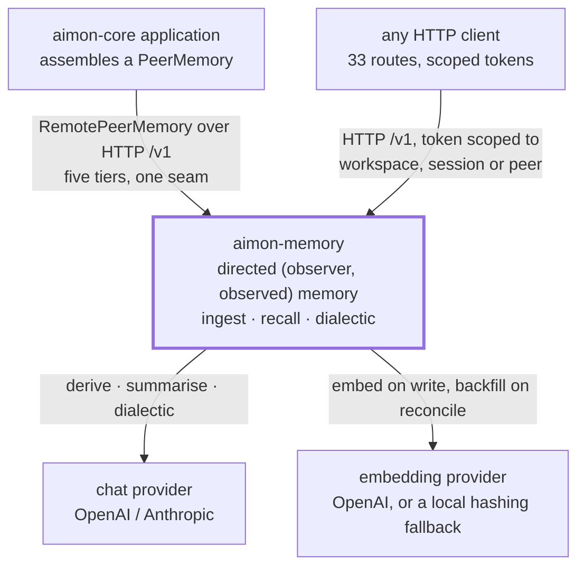

**한국어** · [English](architecture.en.md)

# 아키텍처

이 문서가 aimon-memory 의 **아키텍처 서술 정본**이다. 절 구조는 [arc42](https://arc42.org) 를 따른다 —
새 사실이 어디로 들어가는지 이름 붙은 칸이 있다는 것이 이 형식을 쓰는 이유다.

**이 문서는 얇게 유지한다.** 각 절은 결정과 그 근거를 말하고, 상세는 이미 그것을 소유한 문서로
넘긴다. 같은 사실이 두 곳에서 설명되면 그중 하나는 요약이고, 요약에는 정본 링크가 붙는다.

| 문서 | 무엇을 소유하는가 |
|---|---|
| **이 문서** | 아키텍처 서술 — 목표, 제약, 컨텍스트, 빌딩블록, 품질, 리스크 |
| [`concepts.md`](concepts.md) | 도메인 개념과 메커니즘. 쌍, 여섯 신호, 중복 제거, 망각 |
| [`guide.md`](guide.md) | 호출하는 법. 토큰, 라우트, 설정 키, 에러 |
| [`runbook.md`](runbook.md) | 배포와 운영 |
| [`adr/`](adr/README.md) | 결정 기록 |
| [`openapi.json`](openapi.json) | API 서술. 빌드가 강제한다 |
| [`spec/`](spec/README.md) | 냉동된 명세 (2026-08-31) |

> **명세와의 관계.** `spec/aimon-memory-design.md` 는 규범 문서이고 얼어 있다. 이 문서는 **서술적**이다 —
> 지금 구현이 무엇인지 적을 뿐, 무엇이어야 하는지 정하지 않는다. 왜 그렇게 갈랐는지는
> [ADR 0008](adr/0008-arc42-architecture-doc.md) 에 있다.

---

## 1. 서론과 목표

대화형 에이전트를 위한 메모리 시스템. HTTP API 뒤에서 두 개의 프로세스로 돈다.

### 핵심 요구사항 셋

| | 요구사항 | 왜 1일차에 정해야 했나 |
|---|---|---|
| R1 | 모든 사실은 방향 있는 **`(observer, observed)` 쌍**에 속한다 | 나중에 넣는 것은 마이그레이션이 아니라 재작성이다. 복합 외래키가 모든 결론에 걸려 있다 |
| R2 | 조회는 **모델 없이, 결정적으로** 답한다 | 메모리에 던지는 질문은 대부분 조회다. 조회에 에이전트 값을 내지 않는 것이 이 시스템의 존재 이유다 |
| R3 | 쓰기는 **모델 호출로 HTTP 를 막지 않는다** | 그러면 메모리 시스템이 쓰기를 하는 모든 것의 지연 문제가 된다 |

### 상위 품질 목표 셋

측정 가능한 형태와 그것을 지키는 관문은 [§10](#10-품질-요구사항) 에 있다.

| | 품질 | 한 줄 |
|---|---|---|
| Q1 | **결정성** | Tier 1 순위는 입력의 순수 함수다. 같은 질의에 같은 답 |
| Q2 | **설명 가능성** | 모든 순위가 그것을 만든 여섯 신호를 함께 싣는다. 모든 믿음이 원문 문장까지 되짚힌다 |
| Q3 | **격리** | 한 쌍의 기억이 다른 쌍으로 새지 않는다. 요청 본문으로도 |

### 이해관계자

| 누구 | 이 문서에서 무엇을 기대하는가 |
|---|---|
| aimon-core 를 쓰는 개발자 | 경계가 어디인지, 무엇을 갈아 끼우는지 → [§3](#3-컨텍스트와-범위), [ADR 0007](adr/0007-aimon-core-boundary.md) |
| 이 저장소에 기여하는 사람 | 모듈이 어떻게 나뉘고 무엇이 강제되는지 → [§5](#5-빌딩블록-뷰) |
| 운영하는 사람 | 무엇을 배포하고 무엇을 공개하지 않는지 → [§7](#7-배포-뷰) |
| 순위를 튜닝하는 사람 | 무엇이 관문이고 무엇이 아직 미검증인지 → [§10](#10-품질-요구사항), [§11](#11-리스크와-기술-부채) |

---

## 2. 제약

### 기술 제약

| 제약 | 근거 |
|---|---|
| **JDK 21**, `gradle/libs.versions.toml` 에 고정 | 계획의 Java 25 대신. [ADR 0001](adr/0001-stack.md) |
| **가상 스레드 위 Spring MVC**, WebFlux 아님 | 핸들러가 전부 블로킹 JDBC 다. 리액티브 스택이 줄 동시성을 주면서 코드와 스택 트레이스가 읽힌다 |
| **Postgres 16 + pgvector 하나.** 3-스토어도 Redis 도 없다 | 큐도 테이블이다. 세워야 할 인프라가 하나로 끝난다. [ADR 0001](adr/0001-stack.md) |
| **jOOQ 코드 생성 없음.** 손으로 쓴 SQL + Spring JDBC | 코드 생성은 빌드마다 살아 있는 DB 를 요구하는데, 동적 질의는 `FilterCompiler` 하나뿐이다. [ADR 0002](adr/0002-persistence.md) |
| **제공자 SDK 없음.** 직접 HTTP | 툴 루프를 통제하려면 추상이 어차피 필요하고, record/replay 이음매는 SDK 가 내주지 않는다. [ADR 0003](adr/0003-llm-transport.md) |
| **프로세스 둘, 코드베이스 하나** | 둘은 다르게 확장되고 다르게 실패한다. [§7](#7-배포-뷰) |

### 조직·법적 제약

| 제약 | 근거 |
|---|---|
| **클린룸.** 명세는 `aimon-memory-design.md` 하나뿐이고, 표현에 해당하는 것(프롬프트·스키마·SQL)은 전부 처음부터 썼다 | 참조한 두 시스템 중 하나가 AGPL-3.0 이다. [ADR 0005](adr/0005-agpl-boundary.md) |
| **Apache-2.0** | 이것을 가져다 쓰는 aimon-core 와 같은 라이선스 |
| **aimon-core 와의 접점은 좌표 하나** (`at.aimon.core:aimon-core`) | 형제 체크아웃도 컴포짓 빌드도 없이 새 클론이 빌드된다. [ADR 0007](adr/0007-aimon-core-boundary.md) |

### 관례

- **한국어가 정본.** 모든 문서에 `.en.md` 영어판이 짝으로 붙는다. 예외는 냉동된 명세 둘
  ([`spec/README.md`](spec/README.md) 가 이유를 적는다).
- **문서는 가능하면 빌드가 붙든다.** `openapi.json` 은 생성물과 커밋본을 테스트가 비교한다.
- **다이어그램은 mermaid.** 도구 체인을 늘리지 않기 위해서다. 라벨은 영어라서 두 언어판이 같은 블록을
  공유한다.

---

## 3. 컨텍스트와 범위



### 비즈니스 컨텍스트

| 상대 | 우리가 받는 것 | 우리가 주는 것 |
|---|---|---|
| **aimon-core 애플리케이션** | 메시지, 결론 주입, 질의 — `PeerMemory` 다섯 티어를 통해 | 순위 매긴 결론, 맥락, dialectic 답변 |
| **아무 HTTP 클라이언트** | 라우트 33개, 스코프 있는 토큰 | 같음. aimon-core 없이도 독립적으로 쓸 수 있다 |
| **chat 제공자** | — | 추출·요약·dialectic 프롬프트 |
| **임베딩 제공자** | — | 결론·엔티티·질의 텍스트 |

### 기술 컨텍스트

| 인터페이스 | 프로토콜 | 비고 |
|---|---|---|
| 서비스 API | HTTP, 8080 | `/v1/**` 만 인증 인터셉터가 덮는다 |
| 관리 | HTTP, 9090(API) · 9091(워커) | **공개하지 않는다.** 인증이 없다 |
| 데이터베이스 | JDBC, Postgres 16 + pgvector | Flyway 가 두 프로세스 기동 시 모두 돈다 |
| 제공자 | HTTPS, 직접 호출 | SDK 없음. record/replay 이음매가 붙어 있다 |

### 범위 밖

에이전트 실행, 도구, 프롬프트 주입, 마스킹은 **aimon-core 의 것**이다. 이 저장소는 지속되는
멀티테넌트 메모리를 소유한다 — 스키마, 도출 파이프라인, 순위, 테넌시.
경계는 `at.aimon.core.memory.PeerMemory` 타입 하나이고, 그것뿐이다
([ADR 0007](adr/0007-aimon-core-boundary.md)).

---

## 4. 해결 전략

다섯 개의 선택이 나머지 대부분을 결정한다.

| 선택 | 무엇을 사 오는가 | 대가 |
|---|---|---|
| **쌍 키잉을 1일차에** | 관점이 섞이지 않는다. 밥의 추측이 앨리스의 기억에 들어가지 않는다 | 모든 라우트가 observer·observed 를 명시해야 한다. 기본값이 없다 |
| **Tier 1 을 시스템의 중심에** | 조회가 100ms 에 결정적으로 끝난다. Tier 2 도 이걸 도구로 써서 반복이 줄어든다 | 순위 품질이 이 프로젝트의 리스크 대부분을 진다 → [§10](#10-품질-요구사항) |
| **프로세스 둘** | HTTP 가 모델 호출에 묶이지 않는다. 둘을 따로 확장한다 | 도출이 비동기다. read-your-writes 가 `?wait=derive` 라는 옵트인이 된다 |
| **Postgres 하나** | 세울 인프라가 하나. 큐·클레임·벡터가 한 트랜잭션 경계 안에 있다 | 벡터 검색이 전용 스토어만큼 빠르지 않다. 지금 규모에서는 문제가 아니다 |
| **고정 가중치 융합** | 배포가 달라도 점수를 비교할 수 있다. 픽스처가 소수 6자리까지 못 박는다 | 가중치를 설정으로 열어 둬야 하고, 튜닝은 평가 세트가 있어야 가능하다 |

세부는 [§8](#8-교차-관심사) 과 [`concepts.md`](concepts.md).

---

## 5. 빌딩블록 뷰

### Level 1 — 배포 단위

| 블록 | 책임 | 왜 나뉘어 있나 |
|---|---|---|
| **API** | 수집 접수, Tier 0·1·2, 토큰 발급, 테넌시 CRUD | 지연에 묶여 있다. 마음껏 재시작해도 된다 |
| **Worker** | 도출, 요약, dream, 리컨실 | 제공자 지연에 묶여 있다. 재시작할 때 큐 클레임을 쥐고 있다 |
| **Postgres** | 결론, 엔티티, 메시지, 이벤트, 그리고 큐 | 브로커가 없다. 클레임은 락이 아니라 insert 다 |

### Level 2 — 모듈

의존성은 아래로만 향하고, `ModuleDependencyTest`(ArchUnit)가 그것을 강제한다. 위쪽으로 향하는 import
하나가 들어오면 빌드가 깨진다.

```
aimon-memory-core      nothing. Domain types, six SPIs, key encoding.
aimon-memory-testkit   core, text. Golden fixtures, stubs, the Testcontainers base.

aimon-memory-text      core. Nori / Standard / bigram analyzers, normalisation, BM25, jtokkit.
aimon-memory-embed     core, text. Batching, truncation, retry, order preservation, the Embedder bean.
aimon-memory-llm       core. Provider backends, structured output, tool loop, record/replay.
aimon-memory-store     core, text. Flyway, repositories, pgvector, the filter compiler.

aimon-memory-recall    core, store, text, embed. Six signals, fusion, explain, provenance.
aimon-memory-engine    core, store, recall, llm, embed, text. Deriver, summariser, context,
                       dialectic, dreamer.

aimon-memory-worker    core, engine, store.          [runnable]  (+ text, recall in tests)
aimon-memory-api       core, recall, engine, store.  [runnable]

aimon-memory-client    aimon-core, jackson.          [the adapter, Java 17]
aimon-memory-bom       nothing. A java-platform pinning the published modules.
```

**이 표는 `build.gradle.kts` 가 선언한 것이고, ArchUnit 이 강제하는 것과는 다르다.** 두 목록은 같은
것을 말하지 않는다 — `ModuleDependencyTest` 의 `mayOnlyDependOn` 은 **상한**(허용 목록)이고, 각 모듈의
`build.gradle.kts` 가 **실제 선언**이다. 상한이 더 넓은 자리가 있다: 규칙은 `worker` 와 `api` 에 `llm`
과 `embed` 를 허용하지만 둘 다 선언하지 않고, `recall` 은 오래 `embed` 를 허용받고도 쓰지 않다가
`RecallConfiguration` 이 생기면서 비로소 선언했다. 상한을 읽고 의존이 있다고 결론짓지 말 것 — 이 문서가
오래 틀려 있던 방식이 그것이다.

조립 방향도 같은 규칙 아래 있다. ArchUnit 은 import 만 보므로 **스프링 배선의 방향은 보지 못한다.**
`recall` 이 자기 빈을 스캔하지 않고 `Embedder` 를 `engine` 에서 받던 동안 컴파일 그래프는 깨끗했고
규칙도 통과했다. 그래서 규칙이 아니라 테스트가 그 자리를 지킨다 — `RecallConfigurationTest` 는 recall 을
**engine 없이** 조립해 보이고, 그 모듈의 테스트 소스셋에 있으므로 engine 에서 빈을 찾아 우연히 통과할
수 없다.

계층이 하는 일은 세 트랙이 서로의 코드가 아니라 서로의 스텁을 상대로 만들 수 있게 하는 것이다. 편의를
위한 상향 import 하나가 들어오는 순간 무너지고, 그다음 하나는 정당화하기 쉬워진다.

**여섯 SPI 는 이제 전부 소비된다.** `Analyzer`·`Embedder`·`LlmClient` 는 계속 그랬고,
`ConclusionStore`·`EntityStore`·`EventLog` 는 구현만 있고 부르는 곳이 없었다 — 상위 모듈은 전부
`ConclusionRepository` 같은 구상 클래스를 직접 주입받았다. 그동안 이 셋이 뒷받침하던 주장("저장소를
갈아 끼울 수 있다")은 참이 아니었고, 인터페이스가 다섯 개짜리로 작았던 것이 그럴듯해 보인 이유였다.

지금 규칙은 한 줄이다 — **`aimon-memory-store` 밖에서 호출되는 메서드가 SPI 에 있다.** 그래서
`ConclusionStore` 는 16개, `EntityStore` 는 11개다. 그 모듈의 테스트만 부르는 것(`archiveCandidates`,
`entityIdsFor`)과 아무도 안 부르는 것(`premisesOf`, `findById`)은 구상 클래스에 남았다. 다음 백엔드에
"우리 테스트가 쓰던 메서드"를 구현하라고 요구할 이유가 없기 때문이다.

**어디까지 참인지도 적어 둔다.** 결론·엔티티·감사 로그는 SPI 를 구현하면 갈아 끼울 수 있다. 나머지 아홉
리포지토리(`queue`, `message`, `session`, `peer`, `workspace`, `session_peer`, `dream`, `peer_card`,
`collection`)는 여전히 구상 타입으로 주입된다. `SpiSurfaceTest` 가 그 아홉을 이름으로 적어 두고, 봉인된
셋을 구상 타입으로 되돌리면 빌드를 깬다. 아홉을 마저 봉인할지는 결정 사항이지 누락이 아니다 —
`QueueRepository` 의 클레임은 부분 유니크 인덱스에 대한 insert 이고
([concepts §12](concepts.md#12-큐와-work-unit)), 그런 것 위의 인터페이스는 추상이 아니라 구현의 두 번째
서술이 된다. 이 절이 방금 벗어난 상태가 그것이다.

`aimon-memory-engine` 이 티어 그 자체다 — deriver, dialectic, dreamer, fan-out, 수집. 모듈 이름도
패키지 이름도 제품 이름을 되풀이하지 않도록 `memory` 가 아니라 `engine` 이다.

### Level 3

블랙박스를 더 열지 않는다. 내부는 코드와
[`concepts.md`](concepts.md) 가 소유한다.

---

## 6. 런타임 뷰

네 개의 시나리오가 이 시스템의 동작 대부분을 덮는다. 각각의 전체 서술은 `concepts.md` 에 있다.

| 시나리오 | 한 줄 | 상세 |
|---|---|---|
| **메시지 수집 → 결론** | 저장하고 큐에 넣고 즉시 반환. 배치 게이트가 열리면 워커가 관측하는 쌍마다 한 번 추출하고, 3단 중복 제거를 거쳐 쓴다 | [concepts §6](concepts.md#6-쓰기-경로) · [§7](concepts.md#7-3단-중복-제거) |
| **Tier 1 recall** | 여섯 신호를 모든 후보에 대해 계산하고, 고정 가중치로 합치고, 내역과 함께 돌려준다. 모델 호출 0회 | [concepts §9](concepts.md#9-여섯-신호와-융합-공식) |
| **Tier 2 dialectic** | 도구 루프. Tier 1 이 도구 중 하나다. `reasoningLevel` 이 반복 상한과 도구 세트를 함께 정한다 | [concepts §8](concepts.md#8-읽기-경로--세-개의-티어) |
| **Dream** | 아무도 안 볼 때 연역·귀납·모순을 돌려 새 결론을 만든다. 전부 감사 로그를 지난다 | [concepts §13](concepts.md#13-dreamer-와-peer-card) |

### 이 뷰에서 알아 둘 두 가지

**추출은 배치당 한 번이 아니라 관측하는 쌍마다 한 번 돈다.** 프롬프트가 observer 쪽에서 쓰이기 때문에
두 쌍은 두 개의 다른 질문이다. 비용은 배치당 N + N(N−1) 이고 `observe_others` 가 레버다
([ADR 0006](adr/0006-fanout-cost.md)).

**클레임은 락이 아니라 insert 다.** `work_unit_claims` 의 unique 위반이 "다른 워커가 갖고 있다"를
배우는 방식이라, 모델 호출을 가로질러 트랜잭션이 열려 있지 않다.

---

## 7. 배포 뷰

**정본은 [`runbook.md`](runbook.md) 다.** 토폴로지 다이어그램, 마이그레이션 절차, 튜닝, 부하 프로파일,
백업이 거기 있다. 여기서는 아키텍처적으로 중요한 것만 적는다.

| | API | Worker |
|---|---|---|
| 확장 기준 | 요청률 | 큐 깊이 |
| 묶이는 대상 | 데이터베이스 지연 | 제공자 지연 |
| 마음껏 재시작 | 예 | 예, 다만 클레임이 TTL 까지 남는다 |
| 서비스 포트 | 8080 — **공개한다** | 없음 |
| 관리 포트 | 9090 — **공개하지 않는다** | 9091 — **공개하지 않는다** |

포트 정책이 아키텍처적인 이유. 인증 인터셉터는 `/v1/**` 만 덮는다. 메인 커넥터에 얹힌 actuator 는 그
포트에 닿을 수 있는 무엇에게나 열려 있다는 뜻이고, 그래서 관리 엔드포인트가 별도 커넥터에 있다 —
경로 접두사가 아니라. 같은 이유로 `AIMON_MEMORY_OPENAPI` 의 기본값이 꺼짐이다.

**Flyway 는 두 프로세스 모두에서 기동 시 돈다.** 동시에 떠도 안전하지만(락을 잡는다), 새 마이그레이션의
첫 배포는 인스턴스 하나로 나가는 편이 좋다. 적용된 마이그레이션은 불변이다 —
[런북의 마이그레이션 절](runbook.md#마이그레이션) 이 그 이유와 사고 사례를 담고 있다.

**기동 시 실패하는 것 하나.** `AIMON_MEMORY_JWT_SECRET` 이 없거나 32바이트 미만이면 뜨지 않는다.
`application.yml` 의 개발용 기본값은 저장소에 공개된 서명 키이고, 그것으로 뜬 배포는 정상 배포와
구분되지 않는다.

---

## 8. 교차 관심사

**정본은 [`concepts.md`](concepts.md) 다.** 각 개념의 전체 서술과 그 형태의 근거가 거기 있다. 아래는
아키텍처적으로 중요한 것들의 색인이다.

| 개념 | 아키텍처가 알아야 할 한 줄 | 정본 |
|---|---|---|
| **쌍** | `(workspace, observer, observed)` 가 모든 결론에 걸린 복합 외래키다. 인가는 observer 쪽만 검사한다 | [§1](concepts.md#1-기억은-쌍에-속한다) |
| **테넌시** | workspace · peer · session. 셋 다 처음 쓰일 때 생긴다. 결론은 session 보다 오래 산다 | [§2](concepts.md#2-테넌시--workspace-peer-session) |
| **등급** | 필터가 아니라 신호다. 모순도 올라오되 아래에 앉는다 | [§4](concepts.md#4-등급--이-사실은-얼마나-직접적인가) |
| **순위** | 분모가 상수다. 빠진 신호는 0 을 내고 순서를 건드리지 않는다. 임계값은 융합 점수를 자른다 | [§9](concepts.md#9-여섯-신호와-융합-공식) |
| **중복 제거** | 해시 → 정규화 → 시맨틱. 이기는 기준은 길이가 아니라 정보량. 동점은 새것이 이긴다 | [§7](concepts.md#7-3단-중복-제거) |
| **망각** | 생성 시점이 아니라 마지막 강화 시점부터 잰다. 그래서 선택적이다 | [§11](concepts.md#11-망각) |
| **언어** | 인덱스 설정이 아니라 컬럼이다. 분석기 교체가 마이그레이션이 아니라 재색인이 된다 | [§15](concepts.md#15-텍스트-처리와-언어) |
| **감사** | 결론을 바꾸는 모든 것이 이벤트를 쓴다. dreamer 가 있기 때문에 선택이 아니다 | [§14](concepts.md#14-감사-추적) |
| **큐** | 브로커가 아니라 테이블. 클레임은 insert | [§12](concepts.md#12-큐와-work-unit) |

### 보안

| 관심사 | 방식 |
|---|---|
| 인증 | HS256 JWT. 기본값 없는 서명 키, 상한 30일, 폐기 목록 없음 |
| 인가 | 중첩 스코프 넷(admin·workspace·peer·session) + `RoutePolicy` 라우트 표 |
| 쌍 격리 | `PairScope` 가 observer 쪽을 검사한다. 라우트 표는 경로 변수만 보기 때문에 이게 따로 있다 |
| 사칭 | `canSpeakAs` — peer 토큰은 자기 이름으로만, session 토큰은 그 세션 누구로든 |
| 실패 방향 | **닫힘.** `RoutePolicy` 에 없는 라우트는 거부되고, `RoutePolicyCoverageTest` 가 빌드를 깬다 |
| 필터 표면 | 허용 목록. 없는 필드는 422. 깊이 16 · 노드 256 상한 |

상세와 예제는 [`guide.md` §2](guide.md#2-토큰--가장-먼저-막히는-곳) 와
[§13](guide.md#13-에러-사전).

---

## 9. 아키텍처 결정

ADR 이 정본이다. 여기 되풀이하지 않는다 — [`adr/README.md`](adr/README.md) 가 목록과 한 줄 요약을
갖고 있다.

| 번호 | 무엇을 정했나 |
|---|---|
| [0001](adr/0001-stack.md) | Java 21, 가상 스레드 위 Spring MVC, Postgres 하나 |
| [0002](adr/0002-persistence.md) | 손으로 쓴 SQL 과 Spring JDBC |
| [0003](adr/0003-llm-transport.md) | 제공자 SDK 가 아니라 직접 HTTP |
| [0004](adr/0004-half-life.md) | 최신성 신호는 진짜 반감기 `0.5^(Δ/H)` |
| [0005](adr/0005-agpl-boundary.md) | 클린룸 경계 |
| [0006](adr/0006-fanout-cost.md) | 추출은 관측하는 쌍마다 한 번 |
| [0007](adr/0007-aimon-core-boundary.md) | 경계는 `PeerMemory` 하나 |
| [0008](adr/0008-arc42-architecture-doc.md) | 이 문서와 냉동된 명세의 관계 |

ADR 은 **명세에서 벗어난 자리**만 기록한다. 벗어나지 않은 결정은 거기 없다.

---

## 10. 품질 요구사항

### 품질 트리

```
사용 가능한 메모리 시스템
├─ 결정성 ......... Q1  같은 질의에 같은 답
├─ 설명 가능성 .... Q2  모든 점수와 모든 믿음이 되짚힌다
├─ 격리 ........... Q3  쌍과 테넌트가 새지 않는다
├─ 지연 ........... Q4  조회는 모델 값을 내지 않는다
└─ 정직함 ......... Q5  조용한 폴백보다 시끄러운 실패
```

### 품질 시나리오

| | 시나리오 | 측정 | 지키는 것 |
|---|---|---|---|
| Q1 | 같은 코퍼스·질의를 두 번 recall 한다 | 여섯 신호와 융합 점수가 **소수 6자리까지** 동일 | 골든 픽스처 (`test-fixtures/golden/`) |
| Q1 | 신호가 완전히 같은 결론 둘이 있다 | 순서가 매번 같다 (id 로 동점 처리) | 골든 픽스처 |
| Q2 | 순위 결과를 받는다 | 여섯 신호값·가중치 벡터·매칭 엔티티가 함께 온다. 기본 켜짐 | `explain` 응답 필드 |
| Q2 | 사람이 말한 적 없는 믿음을 만난다 | 엔티티 → 결론 → 전제 → 원문 메시지로 되짚힌다 | `/recall/provenance`, 감사 로그 |
| Q3 | 밥의 토큰으로 앨리스를 observer 로 질의한다 | 403 | `PairScope`, `PairScopeTest` (컨트롤러가 `PairKey` 를 직접 만들면 빌드 실패) |
| Q3 | 정책 항목 없는 라우트를 추가한다 | 빌드 실패 | `RoutePolicyCoverageTest` |
| Q4 | Tier 1 조회 | 모델 호출 0회, 통상 ~100 ms | 설계상. Tier 1 경로에 LLM 의존성이 없다 |
| Q5 | 모르는 설정 키나 못 쓸 값을 쓴다 | 422. 조용한 폴백이 아니다 | 쓰기 경계 검증 |
| Q5 | 허용 목록에 없는 필터 필드를 쓴다 | 422. 빈 결과가 아니다 | `FilterSchema` |
| Q5 | 서명 키 없이 기동한다 | 뜨지 않는다 | `JwtService` 생성자 |

### 관문

```
615  tests, all green
282  need no database        (`test`)          ┐
 21  aimon-core's suite      (`contractTest`)  ┘ the fast gate, `checkAll`
312  need Postgres           (`integrationTest`)
```

`contractTest` 는 이제 셋 중 하나로 세어 둔다. aimon-core 의 `PeerMemory` 계약 스위트 21개이고, 그
아티팩트가 Central 스냅샷에서 풀리게 되면서 CI 에서도 상시로 돈다 — 예전처럼 로컬 publish 를 한 기계에서만
도는 것이 아니다. 자기 소스셋에 있는 이유는 그것이 **릴리스가 아닌 스냅샷**이기 때문이고, 그 이유가
사라지는 시점은 aimon-core 0.3.0 릴리스다.

`integrationTest` 의 312개 중 하나(`LoadTest`)는 `-Daimon.memory.load=true` 로만 돈다. 관문이 아니라
측정이라서 그렇고, 스킵으로 세어져 있다.

| 계층 | 방법 | 관문 |
|---|---|---|
| 순위 | 골든 픽스처 | 소수 6자리, 순위 뒤집힘 0건 |
| 중복 제거 | Testcontainers | 분기마다, 경계마다 테스트 하나씩 |
| 정규화 | Java 와 SQL 을 나란히 | 문자 단위로 일치 |
| LLM 경로 | record/replay | CI 는 replay 전용, 미스는 실패 |
| 인가 | 라우트 allowlist | 정책 항목이 없는 라우트는 빌드를 깬다 |
| 아키텍처 | ArchUnit | 의존성은 한 방향. 검사 대상 모듈의 클래스가 태스크 입력이라 낡은 바이트코드를 보지 않는다 |
| 저장소 경계 | ArchUnit (`SpiSurfaceTest`) | 봉인된 셋은 구상 타입으로 못 부른다. 아직 아닌 아홉은 이름으로 적혀 있다 |
| 조립 방향 | `RecallConfigurationTest` | recall 이 engine 없이 조립된다. 스프링 배선은 ArchUnit 이 못 보는 자리다 |
| 제공자 이름 | 기동 시 검증 | 모르는 provider 이름은 뜨지 않는다. 조용한 폴백이 아니다 |
| 클라이언트 계약 | `OpenApiContractTest` | 어댑터가 읽고 쓰는 필드가 `docs/openapi.json` 에 있다 |
| 인덱스 사용 | seqscan 끈 `EXPLAIN` | 모든 인덱스가 실제 질의로 닿는다 |
| 순위 품질 | 베이스라인 대비 nDCG / MRR | 질의별로도 총합으로도 퇴행 금지 |
| 부하 | 동시 읽기·쓰기 | 오류 0건, 경합 아래에서도 빈틈 없는 시퀀스 |
| 설정 | 쓰기 경계에서 검증 | 모르는 키나 못 쓸 값은 422 |
| 제공자 와이어 포맷 | 임시 포트에 실제 서버 | 요청 본문을 검사한다 |
| API 서술 | 생성한 문서 대 커밋된 문서 | `docs/openapi.json` 이 뒤처지면 실패 |
| aimon-core 어댑터 | 임시 포트에 실제 서버 | 쌍의 방향, 다섯 티어의 본문, 능력 신호 셋 |

두 개는 특히 짚어 둘 값어치가 있다. `RoutePolicyCoverageTest` 는 살아 있는 핸들러 매핑을 훑어서
정책 없는 라우트가 있으면 실패한다 — 누가 호출해도 되는지 정하지 않은 엔드포인트가 프레임워크
기본값을 달고 나가는 대신 빌드가 깨진다. `NormalisationParityTest` 는 정규화의 Java 판과 SQL 판을
비교하고, 개발 중에 진짜 어긋남을 하나 찾아냈다(`btrim` 은 공백만, `strip()` 은 모든 whitespace).

### 순위 품질 — 세 개의 관문을 갈라 둔 이유

서로 다른 이유로 실패하기 때문이다.

**골든 픽스처**는 공식이 명세대로 구현됐음을 증명한다. 가중치가 좋은지는 아무 말도 하지 않는다 —
잘못된 가중치도 일관된 답을 내고, 픽스처는 그것을 충실히 기록한다.

**라벨링된 순위 세트** (`test-fixtures/eval/ranking.json`, 한국어 결론 40개 · 질의 50개 · 등급 판정
103개) 를 커밋된 베이스라인과 견준다. 관문은 한쪽으로만 열려 있다.

```
mean nDCG@5 0.671   nDCG@10 0.700   MRR 0.795   recall@10 0.655
```

품질 주장이 아니라 **퇴행 베이스라인**이다. 제공자 자격 증명이 없으면 임베더가 어휘적으로 동작해서
`sem` 이 두 번째 키워드 신호처럼 굴고, 가장 약한 질의가 개념적인 것들이 된다. 50개 중 12개가 0.35
아래이고 그 전부가 개념적 질의인데, 그 간격이 진짜 임베더가 사 올 것의 추정치다. 깨뜨려서 확인했다 —
가중치를 최신성 쪽으로 옮기면 평균이 떨어지고 관문이 실패한다.

**정성 dialectic 세트** (`test-fixtures/eval/dialectic.json`, 질의 30개와 가중 루브릭) 는 사람이
채점한다. 답이 근거를 딛고 있는지 그럴듯하기만 한지는 판단의 영역이고, 스크립트로 짠 모델은 자기
숙제를 자기가 채점하는 셈이 되기 때문이다.

---

## 11. 리스크와 기술 부채

발견하게 두는 대신 그냥 적는다.

| | 리스크 | 왜 지금 이 상태인가 |
|---|---|---|
| **R1** | **순위 가중치가 실제 의도를 놓고 튜닝되지 않았다** | 관문은 퇴행을 잡을 뿐 가중치가 맞다고는 못 한다. 판정이 합성 임베더 기준으로 채점되기 때문이다. 실제 트래픽이 필요하고, 가중치가 설정값인 이유가 이것이다 |
| **R2** | 평가 세트가 계획의 100–200개가 아니라 **50개 질의** | 일부러 그랬다. 임베더 자리에 어휘적 대역이 서 있는 동안에는 판정을 늘려도 퇴행 관문만 날카로워진다. 나머지는 집필이 아니라 트래픽으로 메워진다 |
| **R3** | **커밋된 LLM 픽스처가 없다** | replay 장치는 다단계 툴 루프까지 끝에서 끝까지 증명됐지만, 기록된 호출은 전부 스크립트 백엔드에서 나왔다 |
| **R4** | **프롬프트가 채점되지 않았다** | 세트와 루브릭은 있지만 실제 모델에 돌려 채점표를 채운 사람이 아직 없다 |
| **R5** | **부하 수치가 노트북에서 나왔다** | 하네스도 숫자도 진짜지만 개발자 기계 위의 컨테이너다. CI 는 작은 프로파일로 돌려 타이밍을 무시한다 |

R1 이 이 프로젝트의 지배적 리스크다. 나머지 넷은 그것을 줄이는 방법에 대한 부채다.

---

## 12. 용어

**정본은 [`concepts.md` §17](concepts.md#17-용어-사전)** 이다. 아래는 이 문서를 읽는 데 필요한
최소한이다.

| 용어 | 무엇인가 |
|---|---|
| **쌍 (pair)** | `(observer, observed)`. 모든 기억이 귀속되는 방향 있는 단위 |
| **결론 (conclusion)** | 오래 남는 사실 하나. 쌍에 속한다 |
| **등급 (level)** | `explicit` · `deductive` · `inductive` · `contradiction` |
| **여섯 신호** | `sem` `kw` `ent` `reinf` `rec` `lvl`. 융합 점수의 항들 |
| **티어 0 · 1 · 2** | `context()` · `recall()` · `chat()` |
| **work unit** | 워커가 집어 가는 단위. 쌍 하나의 한 세션 몫 |
| **workspace · peer · session** | 테넌시 세 층. 번역하지 않는다 |

---

## 부록 — 이 문서에 대하여

절 구조는 [arc42](https://arc42.org) 를 따른다. arc42 템플릿은 Gernot Starke 와 Peter Hruschka 의
것이고 CC BY-SA 4.0 으로 배포된다. 여기서 가져온 것은 절 구조뿐이고, 내용은 전부 이 프로젝트의 것이다.

arc42 를 도입하면서 무엇을 어디로 옮겼고 냉동된 명세와 어떤 관계를 맺는지는
[ADR 0008](adr/0008-arc42-architecture-doc.md) 에 있다.
