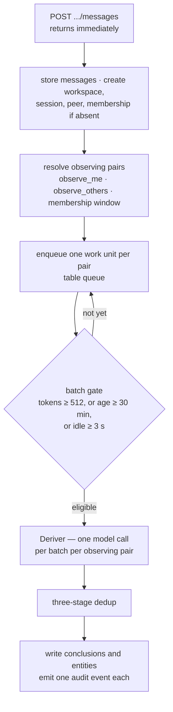

[한국어](concepts.md) · **English**

# Concepts

This document explains **what aimon-memory remembers, and how**. How to call it is in the
[user guide](guide.en.md); the architecture description — goals, constraints, building blocks — is
in the [architecture document](architecture.en.md); the exact routes and schemas are in
[`openapi.json`](openapi.json); deployment and tuning are in the [runbook](runbook.en.md). Here we
take the model underneath, one concept at a time, with the reasoning for each.

One piece of advice on reading order: do not skip
[1. Memory belongs to a pair](#1-memory-belongs-to-a-pair). Everything else stands on it, and
without it half the API looks strange.

> **This document and the specification.** The normative specification is
> [`spec/aimon-memory-design.md`](spec/aimon-memory-design.md), frozen as of 2026-08-31 and written
> in Korean only. This document does not replace it; it describes **what the code does now**. Where
> the implementation departed from the specification, an [ADR](adr/README.en.md) records it with its
> reasoning. When the three disagree, trust code → ADR → specification.

---

## Contents

1. [Memory belongs to a pair](#1-memory-belongs-to-a-pair)
2. [Tenancy — workspace, peer, session](#2-tenancy--workspace-peer-session)
3. [Messages and conclusions are different things](#3-messages-and-conclusions-are-different-things)
4. [Level — how directly grounded is this fact](#4-level--how-directly-grounded-is-this-fact)
5. [Reinforcement — a fact heard again grows younger](#5-reinforcement--a-fact-heard-again-grows-younger)
6. [The write path](#6-the-write-path)
7. [Three-stage dedup](#7-three-stage-dedup)
8. [The read path — three tiers](#8-the-read-path--three-tiers)
9. [Six signals and the fusion formula](#9-six-signals-and-the-fusion-formula)
10. [Entities and provenance](#10-entities-and-provenance)
11. [Forgetting](#11-forgetting)
12. [The queue and work units](#12-the-queue-and-work-units)
13. [The dreamer and the peer card](#13-the-dreamer-and-the-peer-card)
14. [The audit trail](#14-the-audit-trail)
15. [Text processing and language](#15-text-processing-and-language)
16. [What is deterministic and what is not](#16-what-is-deterministic-and-what-is-not)
17. [Glossary](#17-glossary)

---

## 1. Memory belongs to a pair

Most memory systems assume one memory per user. This one does not. Every fact it stores belongs to
a **directed pair** `(observer, observed)`.

- `observer` — **who is remembering.** The owner of this memory.
- `observed` — **who is being remembered.** Who the memory is about.

`(alice, alice)` is what Alice knows about herself; `(bot, alice)` is what the bot knows about
Alice. **These are separate stores, and they never leak into one another.**

### Why go to this trouble

Because the same sentence produces different conclusions from different vantage points.

> Alice: "So many meetings this week I haven't written a line of code."

- `(alice, alice)` — *"had a lot of meetings this week."* A statement of fact about herself.
- `(bob, alice)` — *"Alice feels short of development time when meetings pile up."* Bob's inference
  about Alice. Bob may conclude things Alice never said, and those must not end up in Alice's own
  memory.

Erase the vantage point and merge the two, and Bob's guess about Alice lands in Alice's memory in
Alice's voice. There is no undoing that afterwards.

### The decision is in the schema

`(workspace, observer, observed)` is a **composite foreign key** on every conclusion row. Adding it
later would be a rewrite rather than a migration, so it went in on day one, before anyone asked.

What that means in practice:

- Every route that reads or writes conclusions **must name** `observer` and `observed`. There is no
  default.
- Authorisation checks the **observer side only**. Holding Bob's token is not a claim on what Alice
  remembers. The observed side is deliberately unchecked — keeping a memory of someone is not a
  permission they grant.
- By convention, a query that names no observer means the **self-pair** `(x, x)`.

---

## 2. Tenancy — workspace, peer, session

Three layers sit above the pair. None of the three is translated.

| Layer | What it is | Lifetime |
|---|---|---|
| **workspace** | The isolation boundary. One tenant, one product, one customer. Configuration and language attach here | permanent |
| **peer** | One participant. A person or an agent | permanent |
| **session** | One conversation. Messages accumulate here | goes quiet when the conversation ends, but is not deleted |

All three are **created on first use.** You do not have to create a workspace and register a peer
before posting a message — one `POST .../sessions/s1/messages` creates the workspace, the session,
the peer and the session membership. The explicit creation routes exist for when you want to supply
configuration alongside.

### A session does not sit above a pair

This is the part that trips people up at first. Messages belong to a session, but **conclusions
outlive it.**

- A conclusion records its `session_name`, so you can tell where it came from.
- But recall does not narrow by session. What you learned in last month's conversation you still
  know today.

That is why the `PeerMemory` adapter reports `narrowsBySession()` as `false`. It is not an omission.

### Membership has windows

When a peer joined and left a session is kept append-only in `session_peer_windows`. Someone who
arrived an hour late did not hear what came before, and their memory should not contain it. A peer
who left and came back keeps what they heard the first time without gaining the gap in between.

---

## 3. Messages and conclusions are different things

The system stores two kinds of thing, and confusing them will cost you.

|  | Message | Conclusion |
|---|---|---|
| What | Who said what, verbatim | One durable fact extracted from that |
| Belongs to | a session | a pair `(observer, observed)` |
| Written by | the caller | the deriver (a model), or injected directly |
| Mutable | no, append-only | reinforced, replaced, expired, deleted |
| Searched by | filters and text search | six-signal ranking |

Messages are the **record**; conclusions are the **refined knowledge**. Recall ranks conclusions,
not messages. Messages reappear at the end of a provenance chain, and as tools for Tier 2.

---

## 4. Level — how directly grounded is this fact

Every conclusion carries a `level`: how it came to exist, and how much the ranker trusts it.

| Level | What it is | `lvl` signal |
|---|---|--:|
| `explicit` | Stated in a message. Requires a session | 1.0 |
| `deductive` | Follows necessarily from other conclusions | 0.9 |
| `inductive` | A pattern over other conclusions; carries a confidence | 0.8 |
| `contradiction` | Two conclusions that cannot both hold | 0.6 |

**Level is a signal, not a filter.** A contradiction still surfaces — it just sits lower than
something the user said outright. Hide contradictions and there is no way to ask "these two don't
agree, do they?"

---

## 5. Reinforcement — a fact heard again grows younger

When the same fact is derived again, no new row is made. Two values on the existing row move.

- `times_derived` — how many times it has been re-derived. Incremented.
- `last_reinforced_at` — when that last happened. Set to now.

Each becomes a signal. `reinf` says how often the fact has been confirmed; `rec` says how recently.

The crucial part is that `rec` measures from **the last reinforcement, not from creation**. A fact
that keeps coming up keeps resetting its own clock and never ages, while something mentioned once
slides down on its own. That one line is why forgetting here is selective rather than uniform.

`times_derived` was already being maintained by dedup. Using it in ranking cost nothing.

---

## 6. The write path

From a batch of messages to conclusions.



### 1) Ingestion never calls a model

`POST .../messages` stores, enqueues and **returns immediately**. Blocking an HTTP request on a
model call is what turns a memory system into a latency problem for everything that writes to it.
At most 100 messages per request.

There is one exception, and it is **per request** rather than global. `?wait=derive` blocks until
the work units just queued drain, for up to 30 seconds — for the callers who need read-your-writes.
A global switch would cost everyone the batching win to serve those few. Timing out is **not an
error**: the messages are stored and the work is queued. The caller simply does not see the
conclusions in this response.

### 2) Resolve the observing pairs

Which pairs a message is filed under is decided by two switches, resolved workspace → session →
message with the narrowest scope winning.

- `observe_me` — the speaker keeps a memory of themselves, pair `(p, p)`.
- `observe_others` — a listener keeps a memory of the speaker, pair `(listener, speaker)`.

Both default to `true`. Only peers whose membership window covers the message are considered.

### 3) Batching — any one of three gates

A queued work unit becomes eligible when **any one** of three is true.

| Gate | Default | What it is for |
|---|--:|---|
| `batch.token_threshold` | 512 | Under load. Tokens fill first, so the batching win is kept |
| `batch.max_age_minutes` | 30 | The ceiling when nothing else happens |
| `batch.idle_flush_seconds` | 3 | **The one that makes conversation usable.** People speak, then pause; the pause is when the batch should go |

All three accept zero. Because the gate is an "or", setting one to zero makes it always true, which
is how a workspace turns batching off. A workspace that wants every message derived immediately is
a real configuration, not a mistake.

### 4) Extraction runs once per pair

**This is where the implementation departs from the specification.** The model is called once per
**observing pair** per batch, not once per batch.

The extraction prompt is written from the observer's side — *"record only what bob could reasonably
conclude about alice."* Two pairs hearing the same messages are two different questions with two
different right answers. Sharing one extraction between them would put Alice's conclusions about
herself into Bob's memory, in her voice, with an audit trail saying Bob derived them.

So the bill is O(observing pairs) per batch, which for N mutually-observing peers in a session is
**N + N(N−1)** calls per batch. `observe_others` is the lever that turns the quadratic term off. See
[ADR 0006](adr/0006-fanout-cost.en.md).

What batching buys is unaffected: the token and idle gates collapse a burst of messages into one
call per pair, so the multiplier is over observers rather than over traffic.

---

## 7. Three-stage dedup

Every conclusion the deriver produces passes this gate, so that what is already known is not stored
again.

| Stage | What it looks at | Cost |
|---|---|---|
| 1 | Is the raw hash the same | index lookup |
| 2 | Is the **normalised** string the same | index lookup |
| 3 | Is the embedding cosine distance within `dedup.cosine_distance_max` (0.05) | vector search |

An earlier stage matching short-circuits the rest. Cheapest first.

### What happens on a match

One of three outcomes.

- **`INSERTED`** — nothing matched. A genuinely new fact, so a new row.
- **`REINFORCED`** — an existing row says the same thing at least as well. No new row: its
  `times_derived` goes up and `last_reinforced_at` moves to now.
- **`REPLACED`** — the new phrasing carries more information. The old row is soft-deleted and the
  new one written.

### Which one wins — the information rule

At stage 3 one of the two has to go. The rule is **information content, not length and not
recency**.

```
information = |tokens| + 10 × |distinct tokens|
```

On length alone, *"alice works in Gangnam, Seoul, and she works there"* would beat *"alice works in
Gangnam, Seoul"*. The second term is what stops that. The weight is `dedup.unique_token_weight`.

**Ties go to the newcomer.** That keeps the store converging on the most recent phrasing of a fact
that keeps being restated, instead of freezing the first wording forever.

### Normalisation exists in Java and in SQL

Stage 2's normalisation is implemented in the application and in SQL, and `NormalisationParityTest`
compares the two character for character. It found a real divergence during development: Postgres
`btrim` strips only spaces while Java's `strip()` strips all whitespace, so content containing a tab
was silently skipping stage 2.

---

## 8. The read path — three tiers

Different kinds of question should cost different amounts.

| Tier | Call | Model calls | Typical latency | Deterministic | What it is for |
|---|---|--:|--:|:-:|---|
| 0 | `GET .../context` | 0 | ~50 ms | yes | Conversational context for the next turn |
| 1 | `POST .../recall` | 0 | ~100 ms | yes | **Lookups.** The reason this system exists |
| 2 | `POST .../chat` | 1–16 | seconds | no | Enumerations, contradictions, narrative |

### Tier 0 — context

A token-budgeted view of one session. No model, no vector search.

The budget splits 40% summary / 60% verbatim messages. Recent messages get the larger share because
they are what the next turn is actually about; the summary is there so the model knows what came
before, not so it can reconstruct it.

Messages are taken newest-first and then reversed, so a tight budget drops the oldest rather than
truncating the most recent turn — the one thing that must always survive.

Summaries are produced by the worker: a short one every 20 messages, a long one every 60. Each
regeneration is given the previous summary and produces a summary of everything so far, not of the
new messages alone. Chaining summaries of summaries loses information geometrically; subsuming the
previous one keeps a single lineage that always covers the whole session.

### Tier 1 — recall

**The reason this was built.** Most questions asked of a memory system are lookups, and they should
be fast, cheap and the same answer every time. Six signals under fixed weights. The next section is
entirely about this.

### Tier 2 — chat (dialectic)

The agentic path, for what Tier 1 cannot answer. **It has Tier 1 as one of its tools**, which is the
arrangement the whole design is arguing for. The point was never to remove the agent; it was to stop
paying for one on questions that are lookups, and to give the agent a retriever good enough that it
stops iterating so much when it is genuinely needed.

`reasoningLevel` sets both the iteration cap and the toolset. Default `medium`.

| Level | Max iterations | Tools |
|---|--:|---|
| `minimal` | 1 | `recall` |
| `low` | 3 | + `search_messages` |
| `medium` | 6 | + `grep_messages`, `messages_by_date` |
| `high` | 10 | + `search_temporal`, `reasoning_chain` |
| `max` | 16 | + `entity_provenance` |

Capping iterations alone is not enough, so the toolset shrinks too. Give a model seven tools and it
will use them: a cheap question with an expensive toolset burns its budget exploring.

---

## 9. Six signals and the fusion formula

```
score = 0.50·sem + 0.22·kw + 0.13·ent + 0.08·reinf + 0.05·rec + 0.02·lvl
```

### What each signal is

| Signal | What it measures | How it is computed |
|---|---|---|
| `sem` | Semantic distance between query and conclusion | Embedding cosine similarity, clamped to [0,1] |
| `kw` | Do the query's words actually appear | Raw BM25 squashed by a logistic curve per query-length band |
| `ent` | Is a proper noun the query named linked to this conclusion | Entity neighbour search plus a count discount |
| `reinf` | How often has this been re-confirmed | `1 − 1/(1 + ln(1 + times_derived))` |
| `rec` | How recent was that confirmation | `0.5^(Δdays / half_life_days)` |
| `lvl` | How directly grounded is it | Fixed per level (1.0 / 0.9 / 0.8 / 0.6) |

A word on each.

**`sem`** carries the most weight (0.50). Without a real embedding provider the embedder falls back
to a local hashing implementation, and `sem` then behaves like a second keyword signal — conceptual
queries weaken sharply. The evaluation part of
[architecture §10](architecture.en.md#10-quality-requirements) puts numbers on that gap.

**`kw`** does not use BM25 raw. BM25 is unbounded and its magnitude scales with query length: a
two-word query rarely clears 6, a sixteen-word query routinely passes 15. Normalising by the maximum
in the result set would make a document's score depend on which other documents happened to be
retrieved, destroying the comparability the fixed-weight formula exists to protect. So a **fixed
curve per query-length band** is used instead: the midpoint rises with query length and the
steepness falls.

A raw score of exactly zero is passed through as zero rather than through the sigmoid. No query term
appearing in the document at all is an **absent** signal, not a weak one. Through the sigmoid, every
non-matching candidate would get a floor of about 0.03 — small, but paid uniformly, so it adds noise
without distinguishing anything.

**`ent`** has two mechanisms.

- `countWeight = 1/(1 + 0.001(n−1)²)` discounts entities attached to many conclusions. An entity
  linked to everything in a pair discriminates nothing — this is the entity layer's version of IDF.
  Quadratic and gently scaled, so a dozen links barely register and several hundred do.
- The 0.5 similarity floor is a **hard cut, not a taper**. Vector search always returns its top-k,
  so without a floor every query "matches" some entity and contributes noise to every candidate.

**`reinf`** is logarithmic because the difference between hearing something once and twice is real,
and the difference between the fortieth and forty-first time is not. It never reaches 1, so a
frequently repeated fact can outrank a rare one but cannot dominate `sem` outright.

**`rec`** is `0.5^(Δ/H)`, not `exp(−Δ/H)`. The specification wrote the latter while calling the
parameter a half-life, and the two are not the same function: `exp(−1)` is 0.368, so under that form
a "180-day half-life" actually halves at 125 days. Since the value is exposed as workspace
configuration for people to tune, it has to behave the way its name promises
([ADR 0004](adr/0004-half-life.en.md)).

### Two corrections — why this layer exists

The formula derives from mem0's (Apache-2.0, [ADR 0005](adr/0005-agpl-boundary.en.md)), with two
fixes.

**The denominator is constant.** Weights sum to 1.00 and stay there whether or not a signal produced
anything. The original rescaled by how many stores answered — 1.0, 2.0 or 2.5 — so the same
conclusion scored differently depending on configuration, and scores could be compared neither
across deployments nor against a fixed threshold. Here a missing signal contributes zero: the score
drops honestly, and the ordering among candidates is untouched.

**The threshold applies to the fused score.** The original cut on semantic similarity alone, so a
conclusion an exact keyword query matched could be discarded before fusion ever saw it. That is
precisely the case where the keyword signal was doing its job.

### Both signals are computed for every candidate

A conclusion the vector search found still gets a real BM25 score. Scoring a candidate only on the
signal whose path returned it would let the ranking depend on which path happened to surface a row
first.

### explain is a first-class response field

Every hit comes back with its six signal values, the weight vector used, and the entities that
matched. You cannot tune a ranking you cannot interrogate, so it is **on by default** — pass
`"explain": false` to turn it off. The golden fixtures assert all of it to six decimal places.

Ranking is a pure function of its inputs — including `now`, which is passed rather than read — which
is what lets a fixture pin it. Ties break on id, so two conclusions with identical signals always
come back in the same order.

---

## 10. Entities and provenance

The deriver extracts conclusions **and their entities together**, in one call rather than two.

Entities are the proper nouns pulled out of conclusions (`entities`) and their links
(`entity_links`). They do two jobs.

1. **The `ent` signal** — lifting conclusions the named entity is attached to. It regularly rescues
   a hit the semantic signal misses; that is one of the things the smoke test proves.
2. **Provenance** — starting from an entity and walking backwards.

### Names fold onto a normalised key

A node's identity is not its display name but its **normalised key** (`name_norm`): stripped,
lowercased, and with internal whitespace collapsed to single spaces. So `"Seoul"`, `"seoul"` and
`"  Seoul  "` are **one node**, not three, and the `ent` signal does not scatter when spelling wobbles.

The key is unique **within the workspace** — `UNIQUE (workspace_name, name_norm)` — not within the
pair. The node is shared: every pair that names Seoul points at the same row, which is why a name
mentioned a thousand times is embedded once. What is pair-scoped is the **edge**, in `entity_links`,
which is where the observer and the observed are carried. The two are worth keeping straight, because
`countWeight` discounts an entity by how many conclusions it is attached to, and counting that
workspace-wide rather than inside the querying pair once collapsed the `ent` signal for exactly the
entities it exists to reward.

The same rule is what makes a blank name dangerous. `""`, `"   "` and `"\t"` all fold onto the same
empty key, so they do not become several pieces of junk — they become **one node named nothing**, and
every conclusion carrying a stray empty string links to it. Such a node has edges, so the orphan
sweep keeps it; it has a vector, so it occupies a slot in the index; and it hands `ent` to a set of
conclusions that have nothing in common. So **a blank name is dropped before it can become a node.**

Dropped, not refused. Most names arriving here are model output, and throwing would not even undo
the write: the writer is not transactional, so the conclusions are already stored and would simply be
left without their entity edges, while the work unit retried five times — re-deriving the same facts,
which dedup counts as reinforcement and adds to `times_derived`, the `reinf` signal — before the batch
was quarantined. Injecting directly over HTTP is refused instead — a client can fix its own bug
([`guide.en.md` §4](guide.en.md#option-b--inject-a-conclusion-directly)).

### The provenance chain

`GET .../recall/provenance?entity=Seoul&observer=alice&observed=alice`

```
entity  →  the conclusions it is linked to
             →  each conclusion's premises — the other conclusions that produced it
             →  the source messages — who actually said what
```

Premises that cannot be resolved are listed separately in `unresolvedPremiseIds`. They do not
silently disappear.

This answers exactly one question: **"where did this come from?"** It has to answer it for beliefs
no human ever stated — the ones the dreamer made — which is why it pairs with the audit log.

---

## 11. Forgetting

Two mechanisms, doing different jobs.

**Decay (the `rec` signal).** A conclusion that stops being reinforced slides down the ranking. It
is not deleted. The half-life is `recall.half_life_days` (default 180), and it is a per-workspace
number: a coding agent should forget within weeks, a personal assistant over years.

**Expiry (`expires_at`).** An explicit end time, settable when a conclusion is injected. The
reconciler sweeps what has passed and emits an `expire` event.

Neither is destructive. Deletion is a soft delete, and an event is always left behind.

---

## 12. The queue and work units

**The queue is the `queue` table, not a broker.** The deployment has one piece of infrastructure to
stand up.

A **work unit** is what a worker picks up, and `work_unit_key` is its serialisation key. Two units
with the same key never run at once — two derivations for the same pair in the same session
overlapping would mean dedup cannot see the other.

**Claiming is an insert, not a lock.** A row goes into `work_unit_claims`, and a unique violation is
how a worker learns someone else already owns the key. No advisory locks, and no `SELECT FOR UPDATE`
held open across a model call. A work unit holds a connection only around its own queries and
releases it across the model call — which is why the worker pool can be small, and why concurrency
is bounded by `aimon.memory.worker.concurrency` rather than by the pool.

Claims have a TTL. Restart a worker and its claims linger until that TTL expires, which is why the
runbook treats the API and the worker differently.

---

## 13. The dreamer and the peer card

**The dreamer** tidies memory when nobody is watching: deduction, induction and contradiction search
over what is already known. Two kinds of scheduled work.

- `consolidate` — the real reasoning pass. It produces new knowledge.
- `card_refresh` — regenerates the peer card and nothing else.

**A peer card** is a compact profile of one peer as seen by another. It is wholly replaced, and it
is cheap on purpose — it reads conclusions and writes lines, touching nothing else: no tools, no new
conclusions, and it does not advance the dreamer's scheduling counters. Refreshing a card must not
consume the budget for the reasoning pass that produces new knowledge.

Every line of the card must carry one of four prefixes.

```
IDENTITY:      ATTRIBUTE:      RELATIONSHIP:      INSTRUCTION:
```

The constraint does real work: it forces the model to decide what kind of thing each line is, and it
makes the card mechanically checkable, so a malformed generation is dropped rather than stored and
read as fact later.

---

## 14. The audit trail

**Everything that changes a conclusion writes an event.** This is not bookkeeping. The dreamer edits
memory with nobody watching, and without the log there is no way to answer "where did this come
from" about a belief no human ever stated.

Every event records **who** (actor) and **what** (event).

| actor | Who it is |
|---|---|
| `deriver` | Extracted conclusions from messages |
| `dreamer` | Reasoned while nobody was watching |
| `dedup` | Reinforced or replaced during deduplication |
| `api` | A person called a route directly |
| `reconciler` | Embedding backfill, expiry sweep, queue tidying |

| event | What happened |
|---|---|
| `add` | A new conclusion |
| `reinforce` | The same fact was derived again |
| `replace` | Superseded by a phrasing with more information |
| `delete` | Soft-deleted |
| `expire` | `expires_at` passed |
| `restore` | Brought back |
| `sync_failed` | The embedding call failed, so the row is invisible to semantic recall until retried |

`GET .../conclusions/{id}/events` reads one conclusion's whole history, with `beforeContent` and
`afterContent` alongside.

---

## 15. Text processing and language

**Language is a column, not an index setting.** `content_analyzed` is produced at write time by the
workspace's analyzer, and the index covers that column with the `simple` dictionary.

What that buys: one index serves Korean, English and bigram-fallback workspaces alike, and changing
an analyzer becomes a **re-index** rather than a migration.

The analyzer follows the workspace's `language` tag.

| `language` | Analyzer |
|---|---|
| starts with `ko` | Nori morphological analysis |
| starts with `en` | English analyzer |
| anything else, or unset (`und`) | bigram fallback |

An unknown tag falls back to bigrams rather than throwing. A workspace configured with an
unsupported language should still be searchable.

---

## 16. What is deterministic and what is not

Knowing the boundary tells you what to test and what to cache.

| | Deterministic | Why |
|---|:-:|---|
| Tier 0 `context` | yes | No model, no vector search. The budget split is pinned by a fixture |
| Tier 1 `recall` ranking | yes | A pure function of its inputs, `now` included. Ties break on id |
| Embedding | depends on the provider | Yes for a provider that returns the same vector for the same input |
| Three-stage dedup | stages 1–2 yes | Stage 3 depends on embeddings |
| Deriver | no | Model call |
| Tier 2 `chat` | no | Model call, tool loop |
| Dreamer | no | Model call |

Recall being deterministic is not merely a nice property, it is a **gate**: the golden fixtures pin
the six signals and the fused score to six decimal places, so getting the weights wrong breaks the
build.

---

## 17. Glossary

| Here | In code and the API | What it is |
|---|---|---|
| pair | `observer`, `observed`, `PairKey`, `PairScope` | The directed unit every memory is attributed to |
| conclusion | `conclusions` table, `ConclusionResponse` | One durable fact |
| level | `level` | How directly grounded a conclusion is |
| reinforcement | `times_derived`, `last_reinforced_at` | How often and how recently a fact was re-derived |
| the six signals | `sem`, `kw`, `ent`, `reinf`, `rec`, `lvl` | The terms of the fused score |
| fused score | `score`, and `explain` | The final score under fixed weights, and its breakdown |
| decay · forgetting | `recall.half_life_days`, `expires_at` | An unreinforced conclusion sliding down, then expiring |
| three-stage dedup | hash → normalise → semantic | What keeps a known fact from being stored twice |
| entity | `entities`, `entity_links` | Proper nouns pulled from conclusions, and their links |
| provenance | `/recall/provenance` | entity → conclusion → premise → source message |
| tiers 0 · 1 · 2 | `context()`, `recall()`, `chat()` | The three read paths |
| deriver | `DeriverService` | Extracts conclusions and entities from messages |
| dialectic | Tier 2, `chat()` | The agentic read path, with tools |
| dreamer | the dream consumer | Tidies memory when nobody is watching |
| analyzer | `language`, Nori / English / bigram | Splits text into something indexable |
| queue · work unit | the `queue` table, `work_unit_key` | What a worker picks up, and its serialisation key |
| workspace · peer · session | unchanged | The tenancy layers. Not translated |

---

## What to read next

- [Architecture](architecture.en.md) — goals, constraints, context, building blocks, quality gates,
  risks (arc42's twelve sections)
- [User guide](guide.en.md) — how to actually call all of this
- [`openapi.json`](openapi.json) — 33 routes, schemas, and the token scope each one needs
- [Runbook](runbook.en.md) — deployment, tuning, and what to look at when something is wrong
- [ADRs](adr/README.en.md) — where the implementation departed from the specification, and why
