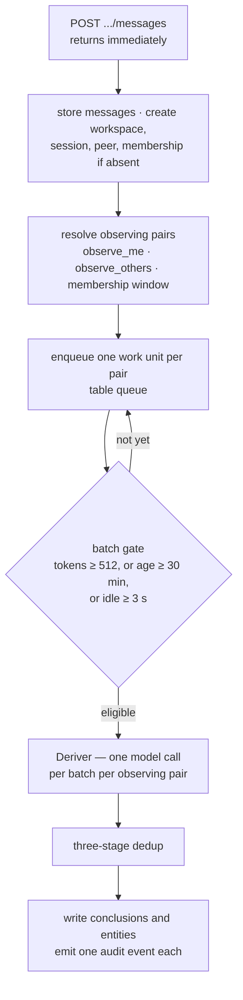

**한국어** · [English](concepts.en.md)

# 개념

이 문서는 aimon-memory 가 **무엇을 어떻게 기억하는지**를 설명한다. 호출하는 방법은
[사용자 가이드](guide.md)에, 목표·제약·빌딩블록 같은 아키텍처 서술은
[아키텍처 문서](architecture.md)에, 라우트와 스키마는 [`openapi.json`](openapi.json)에, 배포와 튜닝은
[런북](runbook.md)에 있다. 여기서는 그 아래에 깔린 모델을 개념 하나씩, 왜 그렇게 생겼는지와 함께 본다.

읽는 순서에 대한 조언 하나. [1. 기억은 쌍에 속한다](#1-기억은-쌍에-속한다)만은 건너뛰지 말 것.
나머지 전부가 그 하나 위에 서 있고, 그것을 모르면 API 의 절반이 이상하게 보인다.

> **이 문서와 명세의 관계.** 정본 명세는
> [`spec/aimon-memory-design.md`](spec/aimon-memory-design.md) 이고 2026-08-31 시점에 얼어 있다.
> 이 문서는 그것을 대체하지 않고, **지금 코드가 하는 일**을 설명한다. 구현이 명세를 벗어난 자리는
> [ADR](adr/README.md) 이 근거와 함께 기록한다. 셋이 어긋나 보이면 믿을 순서는 코드 → ADR → 명세다.

---

## 목차

1. [기억은 쌍에 속한다](#1-기억은-쌍에-속한다)
2. [테넌시 — workspace, peer, session](#2-테넌시--workspace-peer-session)
3. [메시지와 결론은 다른 것이다](#3-메시지와-결론은-다른-것이다)
4. [등급 — 이 사실은 얼마나 직접적인가](#4-등급--이-사실은-얼마나-직접적인가)
5. [강화 — 다시 들은 사실은 젊어진다](#5-강화--다시-들은-사실은-젊어진다)
6. [쓰기 경로](#6-쓰기-경로)
7. [3단 중복 제거](#7-3단-중복-제거)
8. [읽기 경로 — 세 개의 티어](#8-읽기-경로--세-개의-티어)
9. [여섯 신호와 융합 공식](#9-여섯-신호와-융합-공식)
10. [엔티티와 프로버넌스](#10-엔티티와-프로버넌스)
11. [망각](#11-망각)
12. [큐와 work unit](#12-큐와-work-unit)
13. [Dreamer 와 peer card](#13-dreamer-와-peer-card)
14. [감사 추적](#14-감사-추적)
15. [텍스트 처리와 언어](#15-텍스트-처리와-언어)
16. [무엇이 결정적이고 무엇이 아닌가](#16-무엇이-결정적이고-무엇이-아닌가)
17. [용어 사전](#17-용어-사전)

---

## 1. 기억은 쌍에 속한다

대부분의 메모리 시스템은 "사용자 한 명당 기억 하나"를 가정한다. 이 시스템은 그러지 않는다. 저장되는
모든 사실은 **방향이 있는 쌍** `(observer, observed)` 에 속한다.

- `observer` — **기억하는 쪽.** 이 기억을 소유한 주체다.
- `observed` — **기억되는 쪽.** 이 기억이 누구에 대한 것인지다.

`(alice, alice)` 는 앨리스가 자기 자신에 대해 아는 것이고, `(bot, alice)` 는 봇이 앨리스에 대해
아는 것이다. **이 둘은 다른 저장소이고, 서로 섞이지 않는다.**

### 왜 이렇게까지 하는가

같은 문장을 들어도 관점이 다르면 결론이 다르기 때문이다.

> 앨리스: "이번 주는 회의가 너무 많아서 코드를 한 줄도 못 썼어요."

- `(alice, alice)` — *"이번 주 회의가 많았다"*. 자신에 대한 사실 기술.
- `(bob, alice)` — *"앨리스는 회의가 많으면 개발 시간이 부족하다고 느낀다"*. 앨리스를 관찰한 밥의 결론.
  밥은 앨리스가 말하지 않은 것까지 추론할 수 있고, 그것은 앨리스 자신의 기억에 들어가면 안 된다.

관점을 지우고 하나로 합치면, 봅이 앨리스에 대해 내린 추측이 앨리스 본인의 기억에 앨리스의 목소리로
들어간다. 그걸 나중에 되돌릴 방법은 없다.

### 이 결정이 스키마에 박혀 있다

`(workspace, observer, observed)` 는 모든 결론 행에 걸린 **복합 외래키**다. 나중에 추가하는 것은
마이그레이션이 아니라 재작성이라서, 아직 아무도 요구하기 전인 1일차에 넣었다.

실무적으로 이것이 뜻하는 바:

- 결론을 읽고 쓰는 모든 라우트는 `observer` 와 `observed` 를 **요청에 명시해야 한다**. 기본값이 없다.
- 인가는 **observer 쪽만** 검사한다. 밥의 토큰을 쥐었다는 것이 앨리스가 무엇을 기억하는지에 대한
  권리는 아니기 때문이다. 반대로 observed 쪽은 검사하지 않는다 — 누군가를 기억하는 것은 그 사람이
  허락하는 종류의 일이 아니다.
- observer 를 지정하지 않은 질의는 관례상 **self-pair** `(x, x)` 를 가리킨다.

---

## 2. 테넌시 — workspace, peer, session

쌍 위에 세 층이 있다. 셋 다 번역하지 않고 그대로 쓴다.

| 층 | 무엇인가 | 수명 |
|---|---|---|
| **workspace** | 격리 경계. 테넌트 하나, 제품 하나, 고객 하나. 설정과 언어가 여기 붙는다 | 영구 |
| **peer** | 참여자 하나. 사람일 수도 에이전트일 수도 있다 | 영구 |
| **session** | 대화 하나. 메시지가 여기 쌓인다 | 대화가 끝나면 조용해지지만 지워지지 않는다 |

세 가지 모두 **처음 쓰일 때 자동으로 생긴다.** 메시지를 던지기 전에 workspace 를 만들고 peer 를
등록할 필요가 없다 — `POST .../sessions/s1/messages` 한 번이면 workspace, session, peer, 그리고 session
멤버십까지 다 만들어진다. 명시적인 생성 라우트는 설정을 함께 주고 싶을 때를 위해 있다.

### session 은 쌍 위에 있지 않다

이게 처음에 헷갈리는 지점이다. 메시지는 session 에 속하지만, **결론은 session 보다 오래 산다.**

- 결론에는 `session_name` 이 기록된다. 어디서 나왔는지 알기 위해서다.
- 하지만 recall 은 session 으로 좁히지 않는다. 지난달 대화에서 알게 된 것은 오늘 대화에서도 알고
  있어야 하기 때문이다.

그래서 `PeerMemory` 어댑터의 `narrowsBySession()` 이 `false` 다. 빠뜨린 게 아니라 실제로 그렇다.

### 멤버십에는 창(window)이 있다

peer 가 session 에 언제 들어오고 나갔는지가 `session_peer_windows` 에 추가만 되는 방식으로 남는다.
한 시간 뒤에 들어온 사람은 그 전 대화를 듣지 못했고, 그 사람의 기억에 그 내용이 들어가서는 안 된다.
나갔다가 다시 들어온 peer 는 처음에 들은 것을 유지하면서 그 사이의 공백은 얻지 않는다.

---

## 3. 메시지와 결론은 다른 것이다

시스템은 두 가지를 저장하고, 둘을 혼동하면 안 된다.

|  | 메시지 | 결론 |
|---|---|---|
| 무엇 | 누가 무엇을 말했는지, 그대로 | 그 말에서 뽑아낸, 오래 남을 사실 하나 |
| 소속 | session | 쌍 `(observer, observed)` |
| 만드는 것 | 호출자 | Deriver (모델), 또는 직접 주입 |
| 수정 | 안 된다. append-only | 강화·대체·만료·삭제된다 |
| 검색 | 필터와 텍스트 검색 | 여섯 신호 순위 |

메시지는 **원본 기록**이고 결론은 **정제된 지식**이다. recall 이 순위를 매기는 것은 결론이지 메시지가
아니다. 메시지는 프로버넌스의 마지막 단계에서, 그리고 Tier 2 의 도구로 다시 등장한다.

---

## 4. 등급 — 이 사실은 얼마나 직접적인가

결론마다 `level` 이 붙는다. 어떻게 존재하게 됐는지, 그리고 순위가 얼마나 믿어 주는지다.

| 등급 | 무엇인가 | `lvl` 신호값 |
|---|---|--:|
| `explicit` | 메시지에 직접 나온 것. session 이 반드시 있다 | 1.0 |
| `deductive` | 다른 결론들에서 필연적으로 따라 나오는 것 | 0.9 |
| `inductive` | 다른 결론들에 걸친 패턴. confidence 를 함께 갖는다 | 0.8 |
| `contradiction` | 동시에 참일 수 없는 두 결론 | 0.6 |

**등급은 필터가 아니라 신호다.** 모순도 검색 결과에 올라온다 — 사용자가 직접 말한 것보다 아래에 앉을
뿐이다. 모순을 숨기면 "이 두 개가 안 맞는데요"라고 물을 방법이 없어진다.

---

## 5. 강화 — 다시 들은 사실은 젊어진다

같은 사실이 다시 도출되면 새 행을 만들지 않는다. 기존 행의 두 값이 움직인다.

- `times_derived` — 몇 번 다시 도출됐는지. +1.
- `last_reinforced_at` — 마지막으로 다시 도출된 시각. 지금으로.

이 두 값이 각각 신호가 된다. `reinf` 는 얼마나 자주 확인된 사실인지를, `rec` 는 얼마나 최근에
확인됐는지를 말한다.

핵심은 `rec` 가 **생성 시점이 아니라 마지막 강화 시점부터** 잰다는 것이다. 계속 언급되는 사실은
자기 시계를 계속 되돌리며 늙지 않고, 한 번 언급되고 만 것은 알아서 내려간다. 망각이 균일하지 않고
선택적인 이유가 이 한 줄이다.

`times_derived` 는 원래 중복 제거가 이미 세고 있던 값이다. 순위에 쓰는 데에 추가 비용이 들지 않았다.

---

## 6. 쓰기 경로

메시지 한 묶음이 들어와서 결론이 되기까지.



### 1) 수집은 모델을 부르지 않는다

`POST .../messages` 는 저장하고 큐에 넣고 **즉시 반환한다.** HTTP 요청을 모델 호출로 막는 순간
메모리 시스템은 쓰기를 하는 모든 것의 지연 문제가 된다. 요청당 최대 100건.

예외가 하나 있고, 전역이 아니라 **요청당** 옵션이다. `?wait=derive` 를 붙이면 방금 넣은 work unit 이
비워질 때까지 최대 30초 기다린다. read-your-writes 가 필요한 소수를 위해서고, 전역 스위치였다면
모두가 배칭의 이득을 내놓아야 했을 것이다. 30초가 지나면 **오류가 아니라** 그냥 반환한다 — 메시지는
저장됐고 작업은 큐에 있다. 이번 응답에서 결론을 못 볼 뿐이다.

### 2) 관측하는 쌍을 정한다

메시지 하나가 어느 쌍들 아래로 들어갈지는 두 스위치가 정한다. workspace → session → 메시지 순으로
좁은 쪽이 이긴다.

- `observe_me` — 말한 사람이 자기 자신을 기억한다. 쌍 `(p, p)`.
- `observe_others` — 듣는 사람이 말한 사람을 기억한다. 쌍 `(listener, speaker)`.

둘 다 기본값 `true`. 메시지 시점에 session 에 있던 peer 만 후보가 된다.

### 3) 배칭 — 세 조건 중 하나

큐에 쌓인 work unit 은 셋 중 **아무거나 하나**가 참이면 작업 대상이 된다.

| 조건 | 기본값 | 무엇을 위한 것인가 |
|---|--:|---|
| `batch.token_threshold` | 512 | 부하가 걸릴 때. 토큰이 차면 먼저 나간다 |
| `batch.max_age_minutes` | 30 | 아무 일도 안 일어날 때의 상한 |
| `batch.idle_flush_seconds` | 3 | **대화를 쓸 만하게 만드는 조건.** 사람은 말하고 나서 쉰다. 그 쉼이 배치가 나갈 때다 |

셋 다 0 을 허용한다. `or` 게이트라서 하나를 0 으로 두면 항상 참이 되고, 그게 배칭을 끄는 방법이다.
모든 메시지를 즉시 도출하고 싶은 workspace 는 실수가 아니라 실제 설정이다.

### 4) 추출은 쌍마다 한 번 돈다

**여기가 명세와 갈라지는 자리다.** 배치당 한 번이 아니라 **관측하는 쌍마다 한 번** 모델을 부른다.

추출 프롬프트가 observer 쪽에서 쓰이기 때문이다 — *"bob 이 alice 에 대해 합리적으로 결론지을 수 있는
것만 기록하라."* 두 쌍이 같은 메시지를 들어도 서로 다른 질문이고, 답이 다르다. 하나의 추출을 나눠
쓰면 앨리스가 자신에 대해 내린 결론이 앨리스의 목소리로 밥의 기억에 들어가고, 감사 로그에는 밥이
도출했다고 적힌다.

그래서 비용은 배치당 O(관측하는 쌍)이다. 서로를 관측하는 N 명의 세션이라면 배치당 **N + N(N−1)** 회.
`observe_others` 가 그 이차항을 끄는 레버다. 자세한 것은 [ADR 0006](adr/0006-fanout-cost.md).

배칭이 사 오는 것은 그대로 남는다. 토큰·idle 게이트가 메시지 폭주를 쌍당 한 번으로 접기 때문에,
곱해지는 것은 트래픽이 아니라 관측자 수다.

---

## 7. 3단 중복 제거

Deriver 가 뽑아낸 결론 하나하나가 이 관문을 지난다. 이미 아는 것을 다시 넣지 않기 위해서다.

| 단계 | 무엇을 보는가 | 비용 |
|---|---|---|
| 1 | 원문 해시가 같은가 | 인덱스 조회 |
| 2 | **정규화**한 문자열이 같은가 | 인덱스 조회 |
| 3 | 임베딩 코사인 거리가 `dedup.cosine_distance_max`(기본 0.05) 이하인가 | 벡터 검색 |

앞 단계에서 걸리면 뒤 단계는 돌지 않는다. 싼 것부터 본다.

### 걸렸을 때 무슨 일이 일어나는가

셋 중 하나다.

- **`INSERTED`** — 아무것도 안 걸렸다. 진짜 새 사실이므로 새 행.
- **`REINFORCED`** — 기존 행이 적어도 같은 만큼 잘 말하고 있다. 새 행을 만들지 않고 기존 행의
  `times_derived` 를 올리고 `last_reinforced_at` 을 지금으로 민다.
- **`REPLACED`** — 새 표현이 정보를 더 담고 있다. 기존 행을 soft-delete 하고 새 행을 쓴다.

### 어느 쪽이 이기는가 — 정보량 규칙

3단계에서 둘 중 하나는 나가야 한다. 기준은 **길이도 최신성도 아니고 정보량**이다.

```
정보량 = |토큰 수| + 10 × |서로 다른 토큰 수|
```

길이만 봤다면 *"앨리스는 서울 강남에서 일하고, 그녀는 거기서 일한다"* 가 *"앨리스는 서울 강남에서
일한다"* 를 이긴다. 두 번째 항이 그것을 막는다. 가중치는 `dedup.unique_token_weight` 로 조정한다.

동점이면 **새것이 이긴다.** 계속 다시 말해지는 사실이 첫 표현에 영원히 얼어붙는 대신, 가장 최근
표현으로 수렴하게 만드는 선택이다.

### 정규화는 Java 와 SQL 양쪽에 있다

2단계의 정규화는 애플리케이션에도 SQL 에도 구현돼 있고, `NormalisationParityTest` 가 둘을 문자 단위로
비교한다. 개발 중에 진짜 어긋남이 하나 나왔다 — Postgres `btrim` 은 공백만 벗기는데 Java `strip()` 은
모든 whitespace 를 벗겨서, 탭이 든 내용이 2단계를 조용히 건너뛰고 있었다.

---

## 8. 읽기 경로 — 세 개의 티어

질문의 성격이 다르면 값도 달라야 한다.

| 티어 | 호출 | 모델 호출 | 통상 지연 | 결정적 | 무엇을 위한 것인가 |
|---|---|--:|--:|:-:|---|
| 0 | `GET .../context` | 0 | ~50 ms | 예 | 다음 턴에 넣을 대화 맥락 |
| 1 | `POST .../recall` | 0 | ~100 ms | 예 | **조회.** 이 시스템이 존재하는 이유 |
| 2 | `POST .../chat` | 1–16 | 초 단위 | 아니오 | 열거·모순·서사 |

### Tier 0 — context

한 session 의 토큰 예산에 맞춘 뷰. 모델도, 벡터 검색도 없다.

예산은 요약 40% · 원문 메시지 60% 로 나뉜다. 최근 메시지가 큰 쪽을 받는 것은 다음 턴이 실제로 그것에
대한 것이기 때문이고, 요약은 앞에 뭐가 있었는지 알려 주려는 것이지 그걸 복원하라는 것이 아니다.

메시지는 최신부터 담고 나서 뒤집는다. 예산이 빠듯하면 가장 오래된 것이 떨어지지 가장 최근 턴이
잘리지 않는다 — 그건 반드시 살아남아야 하는 하나다.

요약은 워커가 굴린다. 짧은 것은 20메시지마다, 긴 것은 60메시지마다. 매번 이전 요약을 주고
"지금까지 전부"의 요약을 만들게 한다. 요약의 요약을 이어 붙이면 정보가 기하급수적으로 새고, 이전
것을 흡수하게 하면 항상 세션 전체를 덮는 한 줄기가 남는다.

### Tier 1 — recall

**이 시스템을 만든 이유.** 메모리 시스템에 던지는 질문은 대부분 조회이고, 조회는 빠르고 싸고 매번
같은 답이어야 한다. 여섯 신호를 고정 가중치로 합쳐 순위를 매긴다. 다음 절 전체가 이것이다.

### Tier 2 — chat (dialectic)

Tier 1 이 답할 수 없는 질문을 위한 에이전틱 경로. **Tier 1 을 도구 중 하나로 쥐고 있다**는 것이
설계가 주장하는 바다. 에이전트를 없애자는 게 아니라, 조회에 에이전트 값을 내지 말자는 것이고, 정말
필요할 때는 좋은 리트리버를 쥐여 줘서 반복을 줄이자는 것이다.

`reasoningLevel` 이 반복 상한과 도구 세트를 함께 정한다. 기본값은 `medium`.

| 레벨 | 최대 반복 | 도구 |
|---|--:|---|
| `minimal` | 1 | `recall` |
| `low` | 3 | + `search_messages` |
| `medium` | 6 | + `grep_messages`, `messages_by_date` |
| `high` | 10 | + `search_temporal`, `reasoning_chain` |
| `max` | 16 | + `entity_provenance` |

반복만 제한하는 것으로는 부족해서 도구도 함께 줄인다. 모델에게 도구 일곱 개를 주면 쓰기 때문이다 —
싼 질문에 비싼 도구 세트를 주면 예산을 탐색하는 데 태운다.

---

## 9. 여섯 신호와 융합 공식

```
score = 0.50·sem + 0.22·kw + 0.13·ent + 0.08·reinf + 0.05·rec + 0.02·lvl
```

### 각 신호가 무엇인가

| 신호 | 무엇을 재는가 | 어떻게 계산하는가 |
|---|---|---|
| `sem` | 질의와 결론의 의미적 거리 | 임베딩 코사인 유사도를 [0,1] 로 클램프 |
| `kw` | 질의 단어가 실제로 나오는가 | BM25 원점수를 질의 길이별 로지스틱 곡선으로 압축 |
| `ent` | 질의가 짚은 고유명사가 이 결론에 걸려 있는가 | 엔티티 이웃 검색 + 개수 할인 |
| `reinf` | 몇 번이나 다시 확인된 사실인가 | `1 − 1/(1 + ln(1 + times_derived))` |
| `rec` | 마지막 확인이 얼마나 최근인가 | `0.5^(Δ일 / half_life_days)` |
| `lvl` | 얼마나 직접적인 근거를 딛고 있는가 | 등급별 고정값 (1.0 / 0.9 / 0.8 / 0.6) |

각각에 대해 한 마디씩.

**`sem`** 은 가장 무겁다(0.50). 진짜 임베딩 제공자를 붙이지 않으면 로컬 해싱 구현으로 물러나는데,
그때 `sem` 은 사실상 두 번째 키워드 신호처럼 굴고 개념적 질의가 크게 약해진다.
[아키텍처 §10](architecture.md#10-품질-요구사항) 의 평가 절이 그 간격을 숫자로 보여 준다.

**`kw`** 는 BM25 를 그냥 쓰지 않는다. BM25 는 상한이 없고 그 크기가 질의 길이를 따라간다 — 두 단어
질의는 6 을 넘기 어렵고 열여섯 단어 질의는 15 를 예사로 넘는다. 결과 집합의 최댓값으로 정규화하면
어떤 문서가 같이 검색됐는지에 따라 점수가 달라지고, 고정 가중치 공식이 지키려던 비교 가능성이
깨진다. 그래서 질의 길이 밴드별로 **고정된 곡선**을 쓴다. 중점은 질의가 길수록 올라가고 기울기는
낮아진다.

원점수가 정확히 0 이면 시그모이드를 태우지 않고 그냥 0 을 낸다. 질의어가 문서에 하나도 없다는 것은
약한 신호가 아니라 **없는 신호**다. 시그모이드를 태우면 매칭되지 않은 모든 후보가 0.03쯤을 균일하게
받는데, 작지만 모두가 똑같이 내는 값이라 아무것도 구별하지 못하면서 잡음만 더한다.

**`ent`** 에는 두 가지 장치가 있다.

- `countWeight = 1/(1 + 0.001(n−1)²)` — 많은 결론에 걸린 엔티티를 할인한다. 한 쌍의 모든 것에 붙어
  있는 엔티티는 아무것도 구별하지 못한다. 엔티티 층의 IDF 다. 이차식이고 완만해서 열두 개쯤은 거의
  티가 안 나고 수백 개면 확실히 깎인다.
- 유사도 **0.5 바닥은 테이퍼가 아니라 하드 컷**이다. 벡터 검색은 언제나 top-k 를 돌려주므로, 바닥이
  없으면 모든 질의가 뭔가에 "매칭"되고 모든 후보에 잡음이 실린다.

**`reinf`** 가 로그인 것은, 한 번 들은 것과 두 번 들은 것의 차이는 진짜지만 마흔 번째와 마흔한
번째의 차이는 아니기 때문이다. 절대 1 에 닿지 않아서, 자주 반복된 사실이 드문 사실을 이길 수는
있어도 `sem` 을 통째로 눌러 버리지는 못한다.

**`rec`** 는 `0.5^(Δ/H)` 이지 `exp(−Δ/H)` 가 아니다. 명세는 후자를 써 놓고 매개변수를 반감기라고
불렀는데, 둘은 같은 함수가 아니다 — `exp(−1)` 은 0.368 이라서 그 형태에서 "180일 반감기"는 실제로는
125일에 반이 된다. 사람이 튜닝하라고 노출한 설정값이 이름이 약속한 대로 동작해야 해서 고쳤다
([ADR 0004](adr/0004-half-life.md)).

### 두 가지 교정 — 이 층이 존재하는 이유

이 공식은 mem0 의 것에서 왔고(Apache-2.0, [ADR 0005](adr/0005-agpl-boundary.md)), 두 군데를 고쳤다.

**분모가 상수다.** 가중치 합은 1.00 이고, 어떤 신호가 발화하지 않아도 그대로다. 원본은 응답한
스토어 수(1.0 / 2.0 / 2.5)로 다시 스케일링해서, 같은 결론이 설정에 따라 다른 점수를 받았다 — 배포
간 비교도, 고정 임계값과의 비교도 불가능해진다. 여기서 빠진 신호는 0 을 낸다. 점수는 정직하게
떨어지고 후보들 사이의 순서는 건드리지 않는다.

**임계값은 융합 점수를 자른다.** 원본은 시맨틱 유사도만 놓고 잘라서, 키워드가 정확히 일치한 결론이
융합에 닿기도 전에 버려질 수 있었다. 그게 바로 키워드 신호가 제 일을 하고 있던 경우다.

### 두 신호 모두 모든 후보에 대해 계산된다

벡터 검색이 찾아온 결론에도 진짜 BM25 점수가 매겨진다. 자기 경로가 데려온 후보에만 신호를 매기면
순위가 "어느 경로가 먼저 이 행을 건졌는가"에 좌우된다.

### explain 은 1급 응답 필드다

모든 히트가 여섯 신호값, 쓰인 가중치 벡터, 매칭된 엔티티 목록을 함께 싣고 돌아온다. 왜 이게 1등인지
물어볼 수 있어야 순위를 튜닝할 수 있기 때문에, **기본이 켜짐**이다 — 끄려면 `"explain": false` 를
명시해야 한다. 골든 픽스처가 이 전부를 소수 6자리까지 검사한다.

순위는 입력의 순수 함수다 — 읽지 않고 넘겨받는 `now` 를 포함해서. 그래서 픽스처가 소수점까지 못
박을 수 있다. 동점은 id 로 깨서, 신호가 완전히 같은 두 결론이 언제나 같은 순서로 돌아온다.

---

## 10. 엔티티와 프로버넌스

Deriver 는 결론과 **엔티티를 한 번에** 뽑는다. 별도 호출이 아니다.

엔티티는 결론에서 뽑아낸 고유명사(`entities`)와 그 연결(`entity_links`)이다. 두 가지 일을 한다.

1. **`ent` 신호** — 질의가 짚은 이름이 걸린 결론을 끌어올린다. 시맨틱 신호가 놓치는 히트를 자주
   건져 낸다. 스모크 테스트가 증명하는 것 중 하나가 이거다.
2. **프로버넌스** — 엔티티에서 시작해 거꾸로 되짚어 간다.

### 프로버넌스 체인

`GET .../recall/provenance?entity=서울&observer=alice&observed=alice`

```
엔티티  →  그 엔티티가 걸린 결론들
             →  각 결론의 전제(premises) — 이 결론을 만든 다른 결론들
             →  원문 메시지 — 실제로 누가 무슨 말을 했는지
```

전제 중 찾을 수 없는 것은 `unresolvedPremiseIds` 에 따로 실린다. 조용히 빠지지 않는다.

이것이 답하는 질문은 하나다. **"이건 어디서 나온 얘기죠?"** 사람이 한 번도 말한 적 없는 믿음
(dreamer 가 만든 것)에 대해서도 답할 수 있어야 하고, 그래서 감사 로그와 짝을 이룬다.

---

## 11. 망각

두 개의 장치가 있고, 하는 일이 다르다.

**감쇠 (`rec` 신호).** 강화가 멈춘 결론은 순위에서 서서히 내려간다. 지우지 않는다. 반감기는
`recall.half_life_days`(기본 180)이고, workspace 마다 다르게 잡을 값이다 — 코딩 에이전트는 몇 주 만에
잊어야 하고 개인 비서는 몇 년에 걸쳐 잊어야 한다.

**만료 (`expires_at`).** 명시적인 종료 시각. 결론을 주입할 때 지정할 수 있다. 리컨실러가 지난 것을
치우고 `expire` 이벤트를 남긴다.

둘 다 파괴적이지 않다. 삭제는 soft-delete 이고, 이벤트가 남는다.

---

## 12. 큐와 work unit

**큐는 브로커가 아니라 `queue` 테이블이다.** 세워야 할 인프라가 데이터베이스 하나로 끝난다.

**work unit** 은 워커가 집어 가는 단위이고, `work_unit_key` 가 그 직렬화 키다. 같은 키를 가진 일은
동시에 돌지 않는다 — 같은 쌍의 같은 세션에 대한 도출 두 개가 겹치면 중복 제거가 서로를 못 본다.

**클레임은 락이 아니라 insert 다.** `work_unit_claims` 에 한 행을 넣고, unique 위반이 "이 키는 다른
워커가 이미 갖고 있다"를 배우는 방식이다. advisory lock 도, 모델 호출을 가로질러 열려 있는
`SELECT FOR UPDATE` 도 없다. work unit 은 자기 질의 주변에서만 커넥션을 쥐고 모델 호출 동안에는
놓는다. 그래서 워커 풀이 작아도 되고, 동시성은 풀이 아니라 `aimon.memory.worker.concurrency` 가 정한다.

클레임에는 TTL 이 있다. 워커를 재시작하면 클레임이 TTL 까지 남아 있다가 풀린다 — 런북이 API 와 워커를
다르게 다루라고 하는 이유다.

---

## 13. Dreamer 와 peer card

**Dreamer** 는 아무도 보지 않을 때 메모리를 정리한다. 이미 아는 것 위에서 연역·귀납·모순 탐색을
돌려 새 결론을 만든다. 예약 종류는 둘이다.

- `consolidate` — 실제 추론 패스. 새 지식을 만든다.
- `card_refresh` — peer card 만 다시 만든다.

**peer card** 는 한 peer 를 다른 peer 가 본 압축 프로필이다. 통째로 교체되고, 일부러 싸게 만들었다 —
결론을 읽고 줄을 쓸 뿐, 도구도 안 쓰고 새 결론도 안 만들고 dreamer 의 스케줄링 카운터도 건드리지
않는다. 카드 갱신이 진짜 지식을 만드는 추론 패스의 예산을 먹으면 안 되기 때문이다.

카드의 각 줄은 네 접두사 중 하나를 달아야 한다.

```
IDENTITY:      ATTRIBUTE:      RELATIONSHIP:      INSTRUCTION:
```

제약이 실제로 일을 한다. 모델이 각 줄이 어떤 종류인지 정하게 만들고, 카드를 기계적으로 검사
가능하게 만든다. 형식이 깨진 생성물은 저장돼서 나중에 사실처럼 읽히는 대신 버려진다.

---

## 14. 감사 추적

**결론을 바꾸는 모든 것은 이벤트를 쓴다.** 장부 정리가 아니다. Dreamer 는 아무도 보지 않는 사이
메모리를 고치고, 로그가 없으면 사람이 한 번도 말한 적 없는 믿음에 대해 "이건 어디서 왔나"에 답할
길이 없다.

이벤트마다 **누가**(actor)와 **무엇을**(event)이 함께 남는다.

| actor | 누구인가 |
|---|---|
| `deriver` | 메시지에서 결론을 뽑은 것 |
| `dreamer` | 아무도 안 볼 때 추론한 것 |
| `dedup` | 중복 제거가 강화·대체한 것 |
| `api` | 사람이 직접 호출한 것 |
| `reconciler` | 임베딩 백필, 만료 청소, 큐 정리 |

| event | 무슨 일이 있었나 |
|---|---|
| `add` | 새 결론 |
| `reinforce` | 같은 사실이 다시 도출됨 |
| `replace` | 더 정보량이 많은 표현으로 교체됨 |
| `delete` | soft-delete |
| `expire` | `expires_at` 이 지남 |
| `restore` | 되살림 |
| `sync_failed` | 임베딩 호출이 실패해서, 재시도 전까지 시맨틱 recall 에 안 보임 |

`GET .../conclusions/{id}/events` 로 한 결론의 전체 내역을 읽는다. `beforeContent` / `afterContent` 가
함께 실린다.

---

## 15. 텍스트 처리와 언어

**언어는 인덱스 설정이 아니라 컬럼이다.** `content_analyzed` 는 쓰기 시점에 workspace 의 분석기가
만들고, 인덱스는 `simple` 사전으로 그 컬럼을 색인한다.

이 선택이 사 오는 것: 인덱스 하나가 한국어·영어·bigram 폴백 workspace 를 모두 받는다. 그리고 분석기를
바꾸는 일이 마이그레이션이 아니라 **재색인**이 된다.

분석기는 workspace 의 `language` 태그로 정해진다.

| `language` | 분석기 |
|---|---|
| `ko` 로 시작 | Nori 형태소 분석 |
| `en` 으로 시작 | 영어 분석기 |
| 그 외, 또는 미설정 (`und`) | bigram 폴백 |

모르는 태그는 예외를 던지지 않고 bigram 으로 물러난다. 지원하지 않는 언어로 설정된 workspace 도
검색은 돼야 하기 때문이다.

---

## 16. 무엇이 결정적이고 무엇이 아닌가

경계를 알아 두면 어디를 테스트하고 어디를 캐시할지가 정해진다.

| | 결정적인가 | 왜 |
|---|:-:|---|
| Tier 0 `context` | 예 | 모델도 벡터 검색도 없다. 예산 배분이 픽스처로 고정돼 있다 |
| Tier 1 `recall` 순위 | 예 | 입력의 순수 함수. `now` 도 넘겨받는다. 동점은 id 로 깬다 |
| 임베딩 | 제공자에 달림 | 같은 입력에 같은 벡터를 주는 제공자면 그렇다 |
| 3단 중복 제거 | 1·2단계는 예 | 3단계는 임베딩에 달려 있다 |
| Deriver | 아니오 | 모델 호출 |
| Tier 2 `chat` | 아니오 | 모델 호출, 도구 루프 |
| Dreamer | 아니오 | 모델 호출 |

recall 이 결정적이라는 것이 그냥 좋은 성질이 아니라 **관문**이다. 골든 픽스처가 여섯 신호와 융합
점수를 소수 6자리까지 못 박고, 그래서 가중치를 잘못 건드리면 빌드가 깨진다.

---

## 17. 용어 사전

| 이 문서의 표기 | 코드·API 의 표기 | 무엇인가 |
|---|---|---|
| 쌍 | `observer`, `observed`, `PairKey`, `PairScope` | 모든 기억이 귀속되는 방향 있는 단위 |
| 결론 | `conclusions` 테이블, `ConclusionResponse` | 오래 남는 사실 하나 |
| 등급 | `level` | 결론이 얼마나 직접적인 근거를 딛고 있는지 |
| 강화 | `times_derived`, `last_reinforced_at` | 같은 사실이 다시 도출된 횟수와 시점 |
| 여섯 신호 | `sem`, `kw`, `ent`, `reinf`, `rec`, `lvl` | 융합 점수를 만드는 항들 |
| 융합 점수 | `score`, 그리고 `explain` | 고정 가중치로 합친 최종 점수와 그 내역 |
| 감쇠 · 망각 | `recall.half_life_days`, `expires_at` | 강화가 멈춘 결론이 내려가고 결국 만료되는 것 |
| 3단 중복 제거 | 해시 → 정규화 → 시맨틱 | 이미 아는 사실을 다시 넣지 않는 장치 |
| 엔티티 | `entities`, `entity_links` | 결론에서 뽑아낸 고유명사와 그 연결 |
| 프로버넌스 | `/recall/provenance` | 엔티티 → 결론 → 전제 → 원문 메시지 역추적 |
| 티어 0 · 1 · 2 | `context()`, `recall()`, `chat()` | 읽기 경로 셋 |
| Deriver | `DeriverService` | 메시지에서 결론과 엔티티를 뽑는 것 |
| Dialectic | Tier 2, `chat()` | 도구를 쓰는 에이전틱 읽기 경로 |
| Dreamer | dream 컨슈머 | 아무도 안 볼 때 메모리를 정리하는 것 |
| 분석기 | `language`, Nori / English / bigram | 텍스트를 색인 가능한 형태로 쪼개는 것 |
| 큐 · work unit | `queue` 테이블, `work_unit_key` | 워커가 집어 가는 작업 단위와 그 직렬화 키 |
| workspace · peer · session | 그대로 | 테넌시 계층. 번역하지 않는다 |

---

## 다음에 읽을 것

- [아키텍처](architecture.md) — 목표·제약·컨텍스트·빌딩블록·품질 관문·리스크 (arc42 12절)
- [사용자 가이드](guide.md) — 이 개념들을 실제로 호출하는 법
- [`openapi.json`](openapi.json) — 라우트 33개, 스키마, 라우트마다 필요한 토큰 스코프
- [런북](runbook.md) — 배포, 튜닝, 뭔가 잘못됐을 때
- [ADR](adr/README.md) — 구현이 명세를 벗어난 자리와 그 근거
