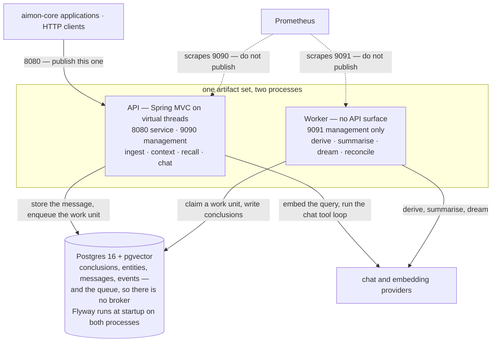

[한국어](runbook.md) · **English**

# Operations

## Deploy

Two processes from one artifact set:



That is the current arrangement. The diagram in
[`spec/aimon-memory-design.md`](spec/aimon-memory-design.md#2-아키텍처) §2 is the record as of
2026-08-31 and still carries Redis as an option; [ADR 0001](adr/0001-stack.en.md) cut it down to one
Postgres. The queue is the `queue` table rather than a broker, and a claim is an insert into
`work_unit_claims` rather than a lock — no transaction stays open across a model call. What that
buys is a deployment with one piece of infrastructure to stand up.

```sh
./gradlew :aimon-memory-api:bootJar :aimon-memory-worker:bootJar
java -jar modules/aimon-memory-api/build/libs/aimon-memory-api-*.jar
java -jar modules/aimon-memory-worker/build/libs/aimon-memory-worker-*.jar
```

They differ in how they should be treated:

| | API | Worker |
|---|---|---|
| Restart freely | yes | yes, but claims linger until TTL |
| Scale on | request rate | queue depth |
| Bound by | database latency | provider latency |
| Pool size | ~20 | ~2× concurrency |

The worker pool is small on purpose. A work unit holds a connection only around its queries, never
across the model call, so concurrency is bounded by `aimon.memory.worker.concurrency` rather than by the pool.

### Environment variables

Everything the two processes read, with the defaults taken from `application.yml`. The defaults line
up with the local `docker compose`, so nothing has to be set during development — **what a deployment
actually has to supply is the first four below plus `AIMON_MEMORY_JWT_SECRET`.**

| Variable | API default | Worker default | What it is |
|---|---|---|---|
| `AIMON_MEMORY_DB_URL` | `jdbc:postgresql://localhost:5432/aimon_memory` | same | JDBC URL |
| `AIMON_MEMORY_DB_USER` | `aimon_memory` | same | database user |
| `AIMON_MEMORY_DB_PASSWORD` | `aimon_memory` | same | password; keeping the default against a remote database fails startup (below) |
| `AIMON_MEMORY_JWT_SECRET` | **none** | — | API only, required. See [Secrets](#secrets) |
| `AIMON_MEMORY_DB_POOL` | `20` | `10` | Hikari maximum pool size — the basis for the table above |
| `AIMON_MEMORY_PORT` | `8080` | — | service port. **Publish this one** |
| `AIMON_MEMORY_MANAGEMENT_PORT` | `9090` | `9091` | actuator. **Do not publish** |
| `AIMON_MEMORY_WORKER_CONCURRENCY` | — | `4` | work units in flight |
| `AIMON_MEMORY_EMBED_DIMENSIONS` | `1536` | same | vector width; also a Flyway placeholder |
| `AIMON_MEMORY_EMBED_PROVIDER` | `hashing` | same | `openai` or `hashing`; anything else fails startup |
| `AIMON_MEMORY_LLM_PROVIDER` | `none` | same | `openai` · `anthropic` · `none`; anything else fails startup |
| `AIMON_MEMORY_LLM_FALLBACK` | `none` | same | used when the first choice fails; same set of names |
| `AIMON_MEMORY_OPENAI_MODEL` | `gpt-4.1-mini` | same | |
| `AIMON_MEMORY_ANTHROPIC_MODEL` | `claude-opus-5` | same | |
| `AIMON_MEMORY_NORI_USER_DICT` | none | same | path to a Korean user dictionary |
| `AIMON_MEMORY_OPENAPI` | `false` | — | `/v3/api-docs`. No reason to enable it in production |
| `AIMON_MEMORY_LOG_LEVEL` | `INFO` | same | the `at.aimon.memory` logger only |

`OPENAI_API_KEY` and `ANTHROPIC_API_KEY` are read under those names, without the prefix. Two families
are deliberately absent here: `AIMON_MEMORY_LLM_MODE` is the test harness's record/replay switch, and
`AIMON_MEMORY_BASE_URL` · `_MANAGEMENT_URL` · `_WORKER_URL` · `_SMOKE_WORKSPACE` · `_FIXTURE_DIR`
belong to `scripts/smoke.sh`.

**An unknown provider name stops startup.** `AIMON_MEMORY_LLM_PROVIDER=openal` used to be treated as
`none`, so the deployment came up, reported healthy, and answered every derivation and dialectic with
`llm_not_configured` — a message naming the setting the operator *did* set, which made it worse. It
now fails at startup as `unknown_llm_provider`. Only `none` and the empty string count as "off". The
embedder behaves the same way (`unknown_embed_provider`), and knows exactly two names, `openai` and
`hashing` — falling back to `hashing` quietly would score lexical overlap and nothing else in
production, which surfaces as bad ranking rather than as an error.

The `AIMON_MEMORY_DB_PASSWORD` default, `aimon_memory`, is the compose stack's password and is
published in this repository — the same kind of value as a signing key. It survives because the local
flow the README documents (`docker compose up`, then `java -jar`) is built around it, and
`DatabaseCredentialCheck` pays for that: **startup fails when the JDBC URL names a host that is not
this machine and the password is still the default** (`default_db_password`). Local hosts
(`localhost`, `127.0.0.1`, `::1`) pass as before.

`AIMON_MEMORY_EMBED_DIMENSIONS` **must match across both processes.** The schema's vector columns are
created at that width, and a mismatch fails startup naming both numbers. Changing it on a database
that already holds vectors is a re-embedding, not a type change — see `V9` under
[Migrations](#migrations) below.

## Migrations

Flyway runs at startup on both processes. Concurrent starts are safe — Flyway takes a lock — but the
first deploy of a new migration should go out on one instance.

Indexes arrive per phase (`V2`–`V11`) rather than all in `V1`, because an unused HNSW index still
slows every insert. Before adding another, check that something queries it.

`V2` and `V3` build HNSW indexes. On a large table that is slow and takes a write lock; use
`CREATE INDEX CONCURRENTLY` in a manual step for an existing deployment and mark the migration as
applied.

**An applied migration is immutable.** Flyway checksums a migration from its raw bytes, before
placeholder substitution, and `validateOnMigrate` is on. Editing `V1` does not re-run it — it stops
every existing deployment from booting with a checksum mismatch, while fresh databases and the
Testcontainers suite, which build the schema from nothing every time, stay green and say nothing.
`V9` exists because the vector columns needed to follow `aimon.memory.embed.dimensions` and `V1` had already
shipped at 1536.

`V9` alters the vector columns only while they hold no vectors, and otherwise fails naming both
widths. Changing the width is a re-embedding, not a type change: pgvector cannot reinterpret a
1536-wide value as 3072-wide. To go through with it, clear the column
(`UPDATE conclusions SET embedding = NULL`) and let the reconciler's backfill rebuild it. Note that
pgvector's HNSW indexes only cover vectors up to 2000 dimensions.

`V11` adds `session_peer_windows`, the append-only record of when each session membership opened and
closed. `session_peers` remains the current state and the observe flags; the windows are what the
dialectic's message tools scope by, so a peer who leaves and rejoins keeps what they heard the first
time without gaining the gap in between.

## Configuration that matters

| Setting | Default | When to change it |
|---|---|---|
| `recall.half_life_days` | 180 | Coding agents forget in weeks, assistants in years |
| `recall.weights` | `[.50 .22 .13 .08 .05 .02]` | After an evaluation set says so, never on a hunch |
| `recall.threshold` | 0 | Raise when recall returns too much noise; it cuts the *fused* score |
| `dedup.cosine_distance_max` | 0.05 | Technical corpora cluster tighter; loosen only with evidence |
| `batch.idle_flush_seconds` | 3 | Lower for conversational UX, raise to batch harder under load |
| `language` | `und` | `ko` or `en`; changing it needs a re-index (below) |

Every value above is checked when it is written: an unknown key, a weight vector that does not sum to
1.00, or a number outside the range it can be honoured in is a 422 rather than a 200 followed by a
silent fallback to the defaults. The check sits on the repository rather than on a route, so it
covers create as well as update and cannot be missed by the next endpoint that writes the column. A
row written straight into the table is not checked, and the API falls back to defaults for it — with
a warning naming the workspace, which is the only trace such a row leaves.

Tuning belongs to the workspace. Peers and sessions have a `configuration` column of their own, but
nothing reads it back into settings, so a tuning key set there is rejected with a 422 rather than
stored and quietly ignored. Keys the system does not recognise are still accepted there as opaque
client data.

Workspace configuration is cached in the API process and evicted on write through the configuration
endpoint. Changing it directly in the database needs a restart.

## Secrets

`AIMON_MEMORY_JWT_SECRET` is required by the API and has no default; a missing or short value stops startup
rather than falling back to something. It signs every token, so rotating it invalidates all of them
at once — there is no revocation list, and token lifetimes are capped at 30 days for that reason.

`aimon.memory.jwt.lifetime` is checked against that cap at startup too, not only when a token is minted. Set
above 30 days it would otherwise boot cleanly and then fail every `POST /v1/tokens` that omits an
explicit lifetime — which is the normal case — with a 400 blaming the request.

`/v1/tokens` narrows an existing token rather than creating one from nothing: a workspace token can
mint peer and session tokens inside its own workspace, and nothing can mint something wider than
itself. The first admin token has to be signed out of band (`scripts/smoke.sh` shows how).

## Common situations

**Conclusions are not appearing.** Check `queue` for unprocessed rows and `work_unit_claims` for a
stale claim. Claims expire after `aimon.memory.worker.claim-ttl`; the reconciler removes them on its next
pass. A work unit stuck at `attempts >= aimon.memory.worker.max-attempts` has been quarantined, and
`last_error` says why.

```sql
SELECT work_unit_key, count(*), min(created_at), max(attempts), max(last_error)
FROM queue WHERE processed = FALSE GROUP BY work_unit_key ORDER BY min(created_at) LIMIT 20;
```

**Recall returns nothing for a Korean query.** Check `analyzedQuery` in the response first — it is
there for exactly this. An empty or wrong analysis means the workspace `language` is not `ko`. Nori
splitting a proper noun is the other common cause; the fix is a user dictionary at
`AIMON_MEMORY_NORI_USER_DICT`.

**A conclusion exists but semantic search never returns it.** Its embedding did not land. The
reconciler retries automatically; `conclusion_events` carries a `sync_error` detail explaining why.

```sql
SELECT id, sync_state, left(content, 60) FROM conclusions
WHERE deleted_at IS NULL AND (sync_state <> 'synced' OR embedding IS NULL) LIMIT 20;
```

**Ranking changed unexpectedly.** `explain` on every hit shows which signal moved. Compare against
`test-fixtures/golden/` — if the fixtures still pass, the formula is intact and the data changed.

## Re-indexing

**After a language change:** re-analyse `content_analyzed` for the workspace, then let the FTS index
rebuild. There is no online path for this yet; it is a scripted pass over the workspace's conclusions.

**After an extraction prompt change:** entity quality is downstream of the prompt, so entities
extracted under the old one may need rebuilding. `conclusion_events.detail->>'prompt_version'`
identifies them. Clearing `entities.embedding` for the workspace makes the reconciler rebuild the
vectors on its next pass.

## Observability

Prometheus at `/actuator/prometheus` on the **management port** (`AIMON_MEMORY_MANAGEMENT_PORT`), not
the service port. The auth interceptor covers `/v1/**` only, so metrics served on the main connector
would be readable by anything that can reach the service.

Both processes read that variable, and their **defaults differ**. The API's management port is 9090,
beside the service port on 8080. The worker serves no API, so actuator is its entire HTTP surface and
that port is 9091 — there is no second connector to keep metrics off. Publish 8080; publish neither
9090 nor 9091.

The API description is off by default for the same reason. `AIMON_MEMORY_OPENAPI=true` opens
`/v3/api-docs` on the service port, which is to say without a token. There is no reason to turn it on
in production: the committed `docs/openapi.json` is the same document, and that one is versioned.
Swagger UI is not shipped at all — its webjar is served by Boot's static mapping whatever this flag
says.

| Metric | Watch for |
|---|---|
| `aimon_memory_worker_unit_seconds` | p99 climbing means provider latency, not database |
| `aimon_memory_worker_items_total{task}` | flat while `queue` grows means claims are stuck |
| `aimon_memory_worker_quarantined_total` | any increase is a poison batch worth reading |
| `hikaricp_connections_pending` | sustained non-zero means the pool is undersized |

The one alert worth having from day one is oldest unprocessed queue row older than
`batch.max_age` plus a margin. It catches a stalled worker, an exhausted provider quota and a claim
leak, all of which are otherwise silent.

## Index behaviour, measured

Numbers from 60k conclusions across 200 pairs on Postgres 16, and from one pair holding 50k.

| Index | Size at 60k | When the planner uses it |
|---|--:|---|
| `ix_concl_hnsw` | **433 MB** | Only once a single pair is large. At ~300 rows per pair it scans the pair instead — correctly, that is cheaper |
| `ix_concl_fts` | 3.5 MB | Selective text queries. Carries the pair columns via `btree_gin`; without them it was never chosen at all |
| `ix_concl_pair` | 416 kB | Nearly everything else |
| `ix_message_trgm` | — | `ILIKE` only. `position()` cannot use it, which is why `grep_messages` is written the way it is |

Two consequences worth planning around.

**The vector index is the dominant storage cost** — roughly 7 KB per conclusion, an order of magnitude
more than the row itself. Budget for it, and remember it only starts paying for itself when a pair
grows past a few thousand conclusions.

**A pair-scoped store defeats global indexes.** The pair predicate is so selective that an index over
the whole table has to scan every workspace's entries to reach one pair. Any new index on
`conclusions` intended for a pair-scoped query needs the scope columns in it, and
`IndexUsageTest` is where that gets checked.

## Load profile

`./gradlew :aimon-memory-worker:loadTest` runs concurrent ingestion and recall and prints percentiles. Knobs:
`-Daimon.memory.load.pairs`, `-Daimon.memory.load.perPair`, `-Daimon.memory.load.readers`, `-Daimon.memory.load.writers`.

On a developer laptop against a container, 20 pairs of 100 conclusions with 32 concurrent readers:

```
recall   n=640   p50  53.4 ms   p95 137.1 ms   p99 201.9 ms
ingest   n=80    p50  57.9 ms   p95 516.7 ms   p99 531.7 ms
```

Ingest p95 is high **because the test deliberately points every writer at one session**. Sequence
allocation takes that session's row lock, so concurrent writers to a single conversation serialise —
which is the intended behaviour and the reason the sequence is gap-free. Writers spread across
sessions do not contend.

If recall p95 climbs in production, the order to check things: pool `pending` first, then whether one
pair has grown large enough that the planner switched to the HNSW index, then `ef_search`.

## Backups

Everything is in Postgres, so an ordinary base backup plus WAL is the whole story. `conclusion_events`
is append-only and is what makes a partial restore auditable — it deliberately has no foreign key to
`conclusions`, so the record of a deletion survives the row it describes.
