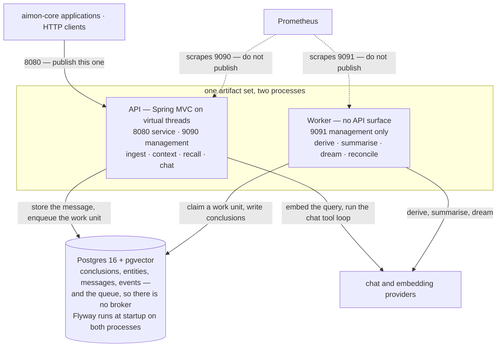

**한국어** · [English](runbook.en.md)

# 운영

## 배포

아티팩트 한 벌에서 프로세스 둘.



현행 배치다. [`spec/aimon-memory-design.md`](spec/aimon-memory-design.md#2-아키텍처) §2 의 그림은
2026-08-31 시점의 기록이라 Redis 를 선택지로 달고 있는데, [ADR 0001](adr/0001-stack.md) 이 그것을
Postgres 하나로 잘라냈다. 큐는 브로커가 아니라 `queue` 테이블이고, 클레임은 락이 아니라
`work_unit_claims` 에 넣는 insert 다 — 모델 호출을 가로질러 트랜잭션을 열어 두지 않는다. 세워야 할
인프라가 데이터베이스 하나로 끝나는 것이 그 대가로 얻는 것이다.

```sh
./gradlew :aimon-memory-api:bootJar :aimon-memory-worker:bootJar
java -jar modules/aimon-memory-api/build/libs/aimon-memory-api-*.jar
java -jar modules/aimon-memory-worker/build/libs/aimon-memory-worker-*.jar
```

둘은 다루는 방법이 다르다.

| | API | Worker |
|---|---|---|
| 마음껏 재시작 | 예 | 예, 다만 클레임이 TTL 까지 남는다 |
| 확장 기준 | 요청률 | 큐 깊이 |
| 묶이는 대상 | 데이터베이스 지연 | 제공자 지연 |
| 풀 크기 | ~20 | 동시성의 ~2배 |

워커 풀이 작은 것은 의도다. work unit 은 자기 질의 주변에서만 커넥션을 쥐고 모델 호출 동안에는 놓기
때문에, 동시성은 풀이 아니라 `aimon.memory.worker.concurrency` 가 정한다.

## 마이그레이션

Flyway 는 두 프로세스 모두에서 기동 시 돈다. 동시에 떠도 안전하지만 — Flyway 가 락을 잡는다 — 새
마이그레이션의 첫 배포는 인스턴스 하나로 나가는 편이 좋다.

인덱스는 `V1` 에 몰아넣지 않고 단계별로(`V2`–`V11`) 들어온다. 쓰지도 않는 HNSW 인덱스가 모든 insert 를
느리게 만들기 때문이다. 하나 더 붙이기 전에 그것을 질의하는 것이 있는지 확인할 것.

`V2` 와 `V3` 은 HNSW 인덱스를 만든다. 테이블이 크면 느리고 쓰기 락을 잡으므로, 이미 돌고 있는 배포에는
수동 단계로 `CREATE INDEX CONCURRENTLY` 를 쓰고 마이그레이션은 적용된 것으로 표시한다.

**적용된 마이그레이션은 불변이다.** Flyway 는 플레이스홀더 치환 전의 원시 바이트로 체크섬을 잡고,
`validateOnMigrate` 는 켜져 있다. `V1` 을 고치면 다시 도는 것이 아니라, 기존 배포 전부가 체크섬 불일치로
못 뜨게 된다. 그동안 매번 스키마를 처음부터 세우는 새 데이터베이스와 Testcontainers 스위트는 초록인 채
아무 말도 하지 않는다. `V9` 가 있는 이유는 벡터 컬럼이 `aimon.memory.embed.dimensions` 를 따라가야 했는데
`V1` 이 이미 1536 으로 나간 뒤였기 때문이다.

`V9` 는 벡터 컬럼에 벡터가 들어 있지 않을 때만 변경하고, 아니면 두 폭을 모두 짚으며 실패한다. 폭을 바꾸는
일은 타입 변경이 아니라 재임베딩이다. pgvector 는 1536 폭 값을 3072 폭으로 다시 해석하지 못한다. 굳이
하려면 컬럼을 비우고(`UPDATE conclusions SET embedding = NULL`) 리컨실러의 백필이 다시 채우게 두면 된다.
pgvector 의 HNSW 인덱스는 2000 차원까지만 덮는다는 것도 함께 기억할 것.

`V11` 은 `session_peer_windows` 를 더한다. 각 세션 멤버십이 언제 열리고 닫혔는지를 추가만 하는 방식으로
남기는 기록이다. 현재 상태와 observe 플래그는 `session_peers` 가 계속 들고 있고, dialectic 의 메시지
도구가 범위를 잡을 때 보는 것은 이 창이다. 그래서 나갔다 다시 들어온 peer 는 처음에 들은 것을 그대로
유지하면서 그 사이의 공백은 얻지 않는다.

## 중요한 설정값

| 설정 | 기본값 | 언제 바꾸나 |
|---|---|---|
| `recall.half_life_days` | 180 | 코딩 에이전트는 몇 주 만에 잊고, 비서는 몇 년에 걸쳐 잊는다 |
| `recall.weights` | `[.50 .22 .13 .08 .05 .02]` | 평가 세트가 그러라고 할 때만. 감으로는 절대 안 된다 |
| `recall.threshold` | 0 | recall 이 잡음을 너무 많이 물어 올 때 올린다. *융합* 점수를 자른다 |
| `dedup.cosine_distance_max` | 0.05 | 기술 코퍼스는 더 촘촘히 뭉친다. 근거가 있을 때만 느슨하게 |
| `batch.idle_flush_seconds` | 3 | 대화형 UX 면 낮추고, 부하가 높으면 더 묶도록 올린다 |
| `language` | `und` | `ko` 또는 `en`. 바꾸면 재색인이 필요하다(아래) |

위의 모든 값은 쓰일 때 검사한다. 모르는 키, 합이 1.00 이 아닌 가중치 벡터, 지킬 수 없는 범위의 숫자는
200 뒤에 조용히 기본값으로 물러나는 대신 422 가 된다. 검사는 라우트가 아니라 리포지토리에 붙어 있어서
update 뿐 아니라 create 도 덮고, 이 컬럼에 쓰는 다음 엔드포인트가 그것을 빠뜨릴 수 없다. 테이블에 곧장
꽂아 넣은 행은 검사되지 않고 API 는 그 행에 기본값을 쓰는데, 이때 workspace 이름을 짚는 경고가 남고 그
경고가 그런 행이 남기는 유일한 흔적이다.

튜닝은 workspace 의 몫이다. peer 와 session 에도 자기 `configuration` 컬럼이 있지만 그것을 설정으로 읽어
들이는 것이 없어서, 거기 설정한 튜닝 키는 저장된 뒤 조용히 무시되는 대신 422 로 거부된다. 시스템이
모르는 키는 불투명한 클라이언트 데이터로 그 자리에 계속 받아 준다.

workspace 설정은 API 프로세스에 캐시되고 설정 엔드포인트를 통한 쓰기에서 무효화된다. 데이터베이스에서
직접 바꾸면 재시작이 필요하다.

## 비밀값

`AIMON_MEMORY_JWT_SECRET` 은 API 에 필수이고 기본값이 없다. 없거나 짧으면 다른 것으로 물러나지 않고 기동이
멈춘다. 모든 토큰에 서명하는 값이라 이것을 교체하면 모든 토큰이 한꺼번에 무효가 된다 — 폐기 목록이 없고,
토큰 수명을 30일로 묶어 둔 이유가 그것이다.

`aimon.memory.jwt.lifetime` 도 토큰을 발급할 때만이 아니라 기동 시에 그 상한과 대조한다. 30일 위로
설정하면 그러지 않을 경우 멀쩡히 떴다가, 명시적 수명을 빼고 부르는 — 그게 정상적인 경우다 —
`POST /v1/tokens` 마다 요청 탓을 하는 400 으로 실패하게 된다.

`/v1/tokens` 는 없던 토큰을 만드는 것이 아니라 있는 토큰을 좁힌다. workspace 토큰은 자기 workspace 안에서
peer 토큰과 session 토큰을 발급할 수 있고, 무엇도 자기보다 넓은 것을 만들지 못한다. 최초의 admin 토큰은
대역 밖에서 서명해야 한다(`scripts/smoke.sh` 에 방법이 있다).

## 자주 마주치는 상황

**결론이 안 생긴다.** `queue` 에 처리되지 않은 행이 있는지, `work_unit_claims` 에 묵은 클레임이 있는지
본다. 클레임은 `aimon.memory.worker.claim-ttl` 이 지나면 만료되고 리컨실러가 다음 패스에서 걷어 간다.
`attempts >= aimon.memory.worker.max-attempts` 에 멈춘 work unit 은 격리된 것이고, 이유는 `last_error` 에
있다.

```sql
SELECT work_unit_key, count(*), min(created_at), max(attempts), max(last_error)
FROM queue WHERE processed = FALSE GROUP BY work_unit_key ORDER BY min(created_at) LIMIT 20;
```

**한국어 질의에 recall 이 아무것도 안 돌려준다.** 응답의 `analyzedQuery` 부터 본다 — 정확히 이 상황을
위해 있다. 분석 결과가 비었거나 이상하면 workspace 의 `language` 가 `ko` 가 아니라는 뜻이다. Nori 가
고유명사를 쪼개는 것이 다른 흔한 원인이고, 해법은 `AIMON_MEMORY_NORI_USER_DICT` 의 사용자 사전이다.

**결론은 있는데 시맨틱 검색이 그것을 절대 안 물어 온다.** 임베딩이 안 들어갔다. 리컨실러가 자동으로
재시도하고, `conclusion_events` 에 이유를 설명하는 `sync_error` 상세가 실린다.

```sql
SELECT id, sync_state, left(content, 60) FROM conclusions
WHERE deleted_at IS NULL AND (sync_state <> 'synced' OR embedding IS NULL) LIMIT 20;
```

**순위가 갑자기 달라졌다.** 히트마다 붙는 `explain` 이 어느 신호가 움직였는지 보여 준다.
`test-fixtures/golden/` 과 견줘 본다 — 픽스처가 아직 통과하면 공식은 멀쩡하고 데이터가 달라진 것이다.

## 재색인

**언어를 바꾼 뒤.** 해당 workspace 의 `content_analyzed` 를 다시 분석하고 FTS 인덱스가 다시 서게 둔다.
아직 온라인 경로는 없다. workspace 의 결론들을 스크립트로 훑는 작업이다.

**추출 프롬프트를 바꾼 뒤.** 엔티티 품질은 프롬프트의 하류이므로, 예전 프롬프트로 뽑힌 엔티티는 다시
세워야 할 수 있다. `conclusion_events.detail->>'prompt_version'` 으로 그것들을 식별한다. 해당 workspace 의
`entities.embedding` 을 비우면 리컨실러가 다음 패스에서 벡터를 다시 만든다.

## 관측

Prometheus 는 서비스 포트가 아니라 **관리 포트**(`AIMON_MEMORY_MANAGEMENT_PORT`)의
`/actuator/prometheus` 에 있다. 인증 인터셉터는 `/v1/**` 만 덮으므로, 메인 커넥터에 얹힌 메트릭은 이
서비스에 닿을 수 있는 무엇이든 읽을 수 있게 된다.

두 프로세스가 같은 변수를 읽지만 **기본값이 다르다.** API 의 관리 포트는 9090 이고, 서비스 포트 8080
옆에 선다. 워커는 API 를 제공하지 않아서 actuator 가 HTTP 표면 전부이고, 그 포트가 9091 이다 —
메트릭을 떼어 놓을 두 번째 커넥터가 없다. 8080 은 공개하고, 9090 도 9091 도 공개하지 말 것.

같은 이유로 API 서술도 기본값이 꺼짐이다. `AIMON_MEMORY_OPENAPI=true` 는 `/v3/api-docs` 를 서비스
포트에, 즉 토큰 없이 연다. 운영에서 켤 이유는 없다 — 커밋된 `docs/openapi.json` 이 같은 문서이고,
그쪽은 버전이 붙어 있다. Swagger UI 는 아예 들어 있지 않다. 그 webjar 는 이 플래그가 뭐라고 하든
Boot 의 정적 매핑이 서빙해 버리기 때문이다.

| 메트릭 | 무엇을 볼 것인가 |
|---|---|
| `aimon_memory_worker_unit_seconds` | p99 가 올라가면 데이터베이스가 아니라 제공자 지연이다 |
| `aimon_memory_worker_items_total{task}` | `queue` 는 자라는데 이것이 평평하면 클레임이 걸린 것이다 |
| `aimon_memory_worker_quarantined_total` | 조금이라도 늘면 읽어 볼 값어치가 있는 독성 배치다 |
| `hikaricp_connections_pending` | 0 이 아닌 상태가 지속되면 풀이 작다 |

첫날부터 걸어 둘 값어치가 있는 경보는 하나다. 처리되지 않은 큐 행 중 가장 오래된 것이 `batch.max_age` 에
여유를 더한 값보다 오래됐을 때. 멈춘 워커, 소진된 제공자 할당량, 새는 클레임을 모두 잡아내고, 그것들은
그러지 않으면 전부 조용하다.

## 인덱스 동작, 측정치

Postgres 16 에서 200개 쌍에 걸친 결론 6만 건, 그리고 한 쌍이 5만 건을 들고 있는 경우에서 나온 숫자다.

| 인덱스 | 6만 건일 때 크기 | 플래너가 언제 쓰나 |
|---|--:|---|
| `ix_concl_hnsw` | **433 MB** | 한 쌍이 커진 뒤에야. 쌍당 300행쯤에서는 쌍을 스캔한다 — 그게 더 싸니까, 올바르게 |
| `ix_concl_fts` | 3.5 MB | 선택적인 텍스트 질의. `btree_gin` 으로 쌍 컬럼을 함께 들고 있는데, 그게 없을 때는 아예 선택된 적이 없었다 |
| `ix_concl_pair` | 416 kB | 그 밖의 거의 전부 |
| `ix_message_trgm` | — | `ILIKE` 전용. `position()` 은 이것을 못 쓰고, `grep_messages` 가 지금처럼 쓰인 이유가 그것이다 |

계획에 넣어 둘 결론 둘.

**벡터 인덱스가 저장 비용을 지배한다** — 결론당 대략 7 KB 로, 행 자체보다 한 자릿수 크다. 예산에 넣어
두고, 한 쌍이 결론 수천 건을 넘긴 뒤에야 값을 하기 시작한다는 것도 기억할 것.

**쌍 스코프 저장소는 전역 인덱스를 무력화한다.** 쌍 조건이 워낙 선택적이라, 테이블 전체를 덮는 인덱스는
쌍 하나에 닿으려고 모든 workspace 의 항목을 훑어야 한다. 쌍 스코프 질의를 겨냥해 `conclusions` 에 새
인덱스를 붙일 때는 스코프 컬럼이 그 안에 들어가야 하고, 그것을 확인하는 자리가 `IndexUsageTest` 다.

## 부하 프로파일

`./gradlew :aimon-memory-worker:loadTest` 는 수집과 recall 을 동시에 돌리고 백분위수를 찍는다. 손잡이는
`-Daimon.memory.load.pairs`, `-Daimon.memory.load.perPair`, `-Daimon.memory.load.readers`, `-Daimon.memory.load.writers`.

개발자 노트북에서 컨테이너를 상대로, 결론 100건짜리 쌍 20개에 동시 리더 32개일 때.

```
recall   n=640   p50  53.4 ms   p95 137.1 ms   p99 201.9 ms
ingest   n=80    p50  57.9 ms   p95 516.7 ms   p99 531.7 ms
```

ingest p95 가 높은 것은 **테스트가 일부러 모든 라이터를 한 세션에 겨누기 때문이다**. 시퀀스 할당이 그
세션의 행 락을 잡으므로 대화 하나에 동시에 쓰는 라이터들은 직렬화된다 — 의도한 동작이고, 시퀀스에 빈틈이
없는 이유다. 세션을 나눠 쓰는 라이터들은 경합하지 않는다.

운영에서 recall p95 가 올라가면 확인할 순서는 이렇다. 풀의 `pending` 을 먼저, 그다음 한 쌍이 플래너가
HNSW 인덱스로 갈아탈 만큼 커졌는지, 그다음 `ef_search`.

## 백업

전부 Postgres 에 있으므로 평범한 베이스 백업에 WAL 이면 이야기가 끝난다. `conclusion_events` 는 추가만
되고, 부분 복구를 감사 가능하게 만드는 것이 그것이다 — `conclusions` 로 향하는 외래키를 일부러 두지
않았기 때문에, 삭제의 기록이 그 삭제가 지운 행보다 오래 남는다.
